# RelyLoop

[](https://scorecard.dev/viewer/?uri=github.com/SoundMindsAI/relyloop)

> **Status: alpha (pre-1.0; MVP2 in progress on `main`).** The only open-source tool that runs automated Bayesian search-space optimization across thousands of trials, on every major open-source search engine (Elasticsearch, OpenSearch, and Apache Solr — all three engines live), and ships winning configs as Pull Requests for your existing approval workflow.

A conversational LLM agent describes the problem and proposes the search
space, but the engineering moat is the loop itself, the Git-PR posture, and
the three-engine reach. RelyLoop runs **thousands of Optuna/TPE trials**
across the full query-time search space (field boosts, function scores,
fuzziness, `mm`, tie-breakers, hybrid weights — not just one slice),
evaluates each trial against `ir_measures`-computed metrics, and opens a
**Pull Request** with the winning configuration against your central
search-config Git repo. Your existing approvers and CI handle deployment;
RelyLoop never sits on the live search-serving path.

See [`docs/07_research/comparison.md`](docs/07_research/comparison.md) for
the citation-backed comparison vs OpenSearch Search Relevance Workbench,
Quepid, RRE, Chorus, and Elastic's native tooling — and why the bundle is
genuinely unique in May 2026.

## The loop

RelyLoop automates the relevance-tuning cycle a human engineer would otherwise
run by hand — the "Karpathy loop": propose a change, measure it, keep what
wins, repeat. The inner loop runs **thousands of Optuna/TPE trials** unattended;
the outer loop hands the winner to your existing Git review + CI. RelyLoop's job
**ends at the Pull Request** — it never touches the live search-serving path.

```mermaid
flowchart LR
    subgraph setup [1 · Set up once]
        direction TB
        A[Register cluster<br/>ES · OpenSearch · Solr] -->|connection verified| B[Define query set<br/>the searches that matter]
        B -->|queries + docs| C[Generate judgments<br/>LLM-as-judge or UBI clicks]
    end

    subgraph inner [2 · Inner loop · thousands of trials · unattended]
        direction TB
        D[Optuna/TPE proposes<br/>query-time params] -->|param set| E[Render query<br/>via engine adapter]
        E -->|engine-native query| F[Search the engine]
        F -->|ranked results| G[Score vs judgments<br/>ir_measures: nDCG, MRR…]
        G -->|trial score steers next proposal| D
    end

    subgraph apply [3 · Apply path · humans stay in control]
        direction TB
        H[Digest<br/>winning config + why it won] -->|proposed config| I[Open Pull Request<br/>to config repo]
        I -->|PR for review| J[Your approvers<br/>review &amp; merge]
        J -->|merged to main| K[Your CI deploys<br/>RelyLoop stops here]
    end

    C ==>|judgment list = ground truth| D
    G ==>|best trial of the study| H
    K -.->|live behavior reveals the next bottleneck| B
```



**How to read it:** **(1)** you set up a cluster, the queries you care about, and a
judgment list (ground truth) once. **(2)** the inner loop is the engine — Optuna
proposes parameters, RelyLoop renders + runs the query through the engine
adapter, scores the results against your judgments, and the score steers the
next proposal; this repeats for thousands of trials with no human in the seat.
**(3)** the best trial becomes a digest and a Pull Request — and that's where
RelyLoop stops: **your** approvers merge and **your** CI deploys. The dotted
arrow closes the loop: production behavior surfaces the next bottleneck to tune.

A conversational LLM agent is the front door that sets this up and explains the
results — but the engineering moat is the loop itself, the Git-PR posture, and
the three-engine reach.

> **📹 Demo:** a 30-second screen recording of a study running end-to-end goes
> here. _(Maintainer TODO — record against the tutorial stack and drop the gif
> in `docs/assets/`.)_

## Quickstart

```bash
git clone https://github.com/SoundMindsAI/relyloop.git
cd relyloop

make up                # auto-generates secrets, builds api + ui images, brings up the stack (~5-10 min first build; ~60s warm)
make seed-clusters     # register local-es + local-opensearch + local-solr
make seed-es           # seed local-es 'products' index from samples/products.json (1,000 docs)

open http://localhost:3000/chat
```

`make up` runs the alembic chain and initializes the Optuna schema automatically
via a `migrate` init container — no separate `make migrate` step needed for a
fresh stack (run `make migrate` only after authoring a new revision without
bouncing the stack).

Tutorial — the full operator walkthrough from `git clone` through "PR opened
in GitHub" — is in
[`docs/08_guides/tutorial-first-study.md`](docs/08_guides/tutorial-first-study.md).

For a local-LLM walkthrough (Ollama / LM Studio / vLLM / TGI instead of OpenAI),
see Step 0 of the tutorial.

**Hardware:** 16 GB RAM is comfortable. Elasticsearch + OpenSearch each consume
~1 GB heap; bump `ES_HEAP_SIZE` in `.env` if you index large corpora.

## What's in MVP1 / What's coming

MVP1 ships the full Karpathy loop end-to-end on Elasticsearch + OpenSearch:
chat agent, Optuna/TPE optimizer, LLM-as-judge, digest, GitHub PR worker,
single-tenant install. **MVP2 (in progress on `main`)** completes the
three-engine reach — **Apache Solr is now live** — and adds UBI judgments +
hybrid UBI+LLM (bundled). **MVP3** adds local-first observability (Langfuse +
SigNoz). **GA v1** is polish + governance + hardening — no new product
surface; all six differentiators are in by MVP3.

Canonical release matrix:
[`docs/01_architecture/tech-stack.md`](docs/01_architecture/tech-stack.md) —
do not duplicate here, the matrix is the source of truth.

## Key design choices

- **Engine-neutral across all three OSS engines** — Elasticsearch, OpenSearch, and Apache Solr, each behind one `SearchAdapter` Protocol (ES + OpenSearch share the `ElasticAdapter`; Solr has its own). These three are the only supported engines.
- **Full-search-space Bayesian/TPE optimization** — Optuna across field boosts, function scores, fuzziness, `mm`, tie-breakers, hybrid weights, LTR rescoring. Not a 66-cell grid over hybrid weights alone (the only thing OpenSearch SRW's optimizer covers today).
- **Git-as-source-of-truth** — winning configs land as PRs against a central config repo; deployment is the operator's CI's job, not RelyLoop's. OpenSearch SRW has no apply path by explicit RFC choice; this is a stable differentiator.
- **Single-endpoint LLM flexibility** — one env var (`OPENAI_BASE_URL`) is the entire LLM integration surface. Works against any OpenAI-compatible endpoint: OpenAI cloud, Ollama (local), LM Studio (local), vLLM (local or remote), HuggingFace TGI, Azure OpenAI's OpenAI-compatible mode, OpenRouter (multi-model routing), or LiteLLM proxy in front of Bedrock / Vertex / Anthropic native. Truly air-gapped deployments run RelyLoop against Ollama on the same VM with zero data leaving the network. See [`docs/08_guides/llm-endpoint-setup.md`](docs/08_guides/llm-endpoint-setup.md). Native non-OpenAI provider SDKs are in the backlog as an ergonomics upgrade — the unblocking pattern (LiteLLM proxy or OpenRouter) covers most adopters today.
- **Local-first observability** — Langfuse + SigNoz both self-hosted (MVP3); no LLM trace data leaves the deployment VM.
- **Single-tenant through GA v1** — multi-tenancy is in the backlog; SSO via reverse proxy is the recommended path for now.
- **Deliberate, not real-time** — RelyLoop is for offline experimentation and change management; it does not sit on the live search-serving path. Online learning / bandits / production-quality monitoring are a v2 Path B direction.

See spec §4 (non-goals) for the full set.

## How RelyLoop fits with other relevance tools

RelyLoop is not the first tool in the search-relevance space and does not try
to replace the tools already there. It sits alongside Quepid (interactive
workbench), the OpenSearch Relevance Agent (in-cluster automated tuning for
OpenSearch-only shops), Chorus (reference integration stack), SMUI + Querqy
(query-rewriting rules), Elasticsearch / Solr LTR (reranker model training),
OpenSearch UBI (real user signals), and the rest of the open-source relevance
ecosystem.

The slice RelyLoop owns is **autonomous, engine-agnostic, Git-PR-mediated
query-time parameter tuning** — useful when you operate Elasticsearch or both
ES + OpenSearch, want production config changes to flow through a Pull
Request reviewed by named approvers, run multiple clusters / environments,
or eventually want one tool that spans engines.

The full breakdown — honest assessment of where each adjacent tool fits,
where RelyLoop fits, and the pairing patterns we recommend — is in
[`docs/00_overview/adjacent-tools.md`](docs/00_overview/adjacent-tools.md).

## Links

- Documentation: https://relyloop.com
- Tutorial: [`docs/08_guides/tutorial-first-study.md`](docs/08_guides/tutorial-first-study.md)
- Umbrella spec: [`docs/00_overview/relyloop-spec.md`](docs/00_overview/relyloop-spec.md)
- Architecture index: [`docs/01_architecture/`](docs/01_architecture/)
- Local-dev runbook: [`docs/03_runbooks/local-dev.md`](docs/03_runbooks/local-dev.md)
- Release checklist (maintainers): [`docs/03_runbooks/release-checklist.md`](docs/03_runbooks/release-checklist.md)
- Contributing: [`CONTRIBUTING.md`](CONTRIBUTING.md)

## License

Apache License 2.0 — see [LICENSE](LICENSE) and [NOTICE](NOTICE).

## Contributing

See [CONTRIBUTING.md](CONTRIBUTING.md) for dev setup, branching, and PR conventions. Contributions use the Developer Certificate of Origin (DCO) — sign your commits with `git commit -s`. Be kind ([CODE_OF_CONDUCT.md](CODE_OF_CONDUCT.md)).

## Security

Vulnerabilities go through [SECURITY.md](SECURITY.md), not public issues.

## Governance and maintainers

- Current maintainers: [MAINTAINERS.md](MAINTAINERS.md). At v0.1, all maintainers are soundminds.ai employees — stated openly so the bus factor is visible.
- How decisions are made + the plan to grow the maintainer set across organizations: [GOVERNANCE.md](GOVERNANCE.md). The transition target is 12–24 months from MVP1's first stable release.

## Reaching out

For casual outreach, design conversations, or "is RelyLoop right for my team?" questions, the project lead is reachable at:

- Email: `eric.starr@soundminds.ai`
- X: [@Starrman777](https://x.com/Starrman777)
- LinkedIn: [linkedin.com/in/starrman](https://www.linkedin.com/in/starrman/)

For bug reports use [GitHub Issues](https://github.com/SoundMindsAI/relyloop/issues); for security vulnerabilities use [SECURITY.md](SECURITY.md); for design discussions in the open use [GitHub Discussions](https://github.com/SoundMindsAI/relyloop/discussions).
