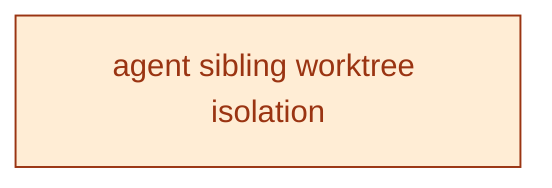

[← Roadmap overview](DASHBOARD.md)

# RelyLoop BACKLOG Dashboard

_Reflects feature-folder state as of **2026-06-04** (latest mtime of any planned/implemented feature `.md` file). Regenerated by `make dashboard` and the `mvp1-dashboard-regen` pre-commit hook. For the rich local view (filter chips, type colors), open [`backlog_dashboard.html`](backlog_dashboard.html) in a browser._

## Next up

**[infra_agent_sibling_worktree_isolation](planned_features/99_backlog/infra_agent_sibling_worktree_isolation/feature_spec.md)** — Infra, currently in **Implementing**

> Add a tight "Working in sibling worktrees" section to `CLAUDE.md` between `## Common Pitfalls` and `## Bug Fix Protocol` that catalogs which host paths are bind-mounted by the Compose stack (and therefore leak to the main worktree when writ

Implementation in progress — resume to finish

```bash
/pipeline docs/00_overview/planned_features/99_backlog/infra_agent_sibling_worktree_isolation/phase3_idea.md
```

## BACKLOG Progress

| Metric | Value |
|---|---|
| Filed under BACKLOG | **3** folders total (done + specced not-done + idea backlog + bugs) |
| Specced features done | **0 / 1** (0%) — of features *past the idea stage* (those with a spec); the idea backlog below is NOT in this denominator, so 100% ≠ release complete |
| Pending work | **3** items (every not-done feat/infra/chore/bug across all priorities) |
| → P0 — do next | **0** unblocking / paying daily cost |
| → P1 | **0** high-value, ready when P0 clears |
| → P2 (default) | 2 important to file, not blocking |
| → Backlog | 1 captured for record, not planned |
| Open bugs | 1 |
| Legacy "Path to BACKLOG" | 3 items — scoped-not-done + bugs + chore-ideas only (excludes feat/infra ideas) |
| Backlog ideas | 0 idea-only feat/infra (not yet scoped into BACKLOG) |
| In flight | 1 feature(s) actively shipping |

## Pipeline

### Done (0)

_None._

### Implementing (1)

| # | Priority | Feature | Type | One-liner | Depends on | Status |
|---|---|---|---|---|---|---|
| 1 | P2 | [infra_agent_sibling_worktree_isolation](planned_features/99_backlog/infra_agent_sibling_worktree_isolation/feature_spec.md) | Infra | Add a tight "Working in sibling worktrees" section to `CLAUDE.md` between `## Common Pitfalls` and `## Bug Fix Protocol` that catalogs which host paths are bind-mounted by the Compose stack (and there | — | [PR #249](https://github.com/SoundMindsAI/relyloop/pull/249) merged 2026-05-25 |

### Plan (0)

_None._

### Spec (0)

_None._

### Idea (2)

| # | Priority | Feature | Type | One-liner | Depends on | Status |
|---|---|---|---|---|---|---|
| 1 | P2 | [bug_starlette_request_poisons_fastapi_depends_tests](planned_features/99_backlog/bug_starlette_request_poisons_fastapi_depends_tests/idea.md) | Bug | There is shared state somewhere in starlette / FastAPI that is mutated by `Request(scope={"type": "http", ...})` and breaks subsequent `Depends` resolution. Possible suspects: | — | Idea — bug captured during feat_index_document_browser Story 2.1 |
| 2 | Backlog | [chore_demo_reseed_stale_recovery_atomic_cas](planned_features/99_backlog/chore_demo_reseed_stale_recovery_atomic_cas/idea.md) | Chore | PR #299 added stale-status auto-recovery to the demo-reseed POST handler ([`_test.py`](../backend/app/api/v1/_test.py)): when the Redis status is `running` but `started_at` is older than `DEMO_RESEED_ | — | Idea — captured during PR #299 GPT-5.5 final review (finding #2, adjudicated non-regression) |

## Dependency graph

Scoped feat/infra/chore nodes only. Idea-stage debt is omitted.



---

Source of truth: feature folders under [`docs/00_overview/planned_features/`](planned_features/) and [`docs/00_overview/implemented_features/`](implemented_features/). See [`state.md`](../../state.md) for active-branch context and [`CLAUDE.md`](../../CLAUDE.md) for conventions.
