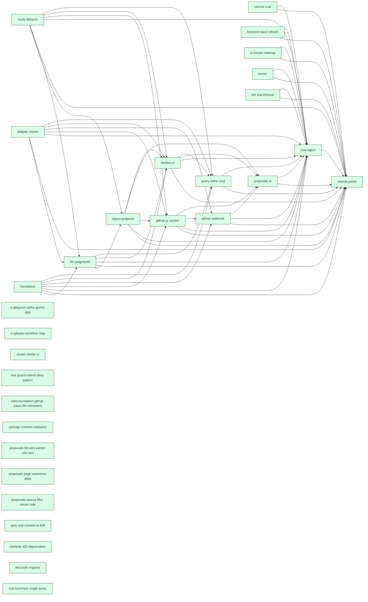

# RelyLoop MVP1 Dashboard

_Reflects feature-folder state as of **2026-05-14** (latest mtime of any planned/implemented feature `.md` file). Regenerated by `make dashboard` and the `mvp1-dashboard-regen` pre-commit hook. For the rich local view (filter chips, type colors), open [`mvp1_dashboard.html`](mvp1_dashboard.html) in a browser._

## Next up

All scoped MVP1 features shipped 🎉

Pull from the Idea backlog or capture a new feature spec.

## MVP1 Progress

| Metric | Value |
|---|---|
| Scoped items done | **30 / 30** (100%) — feat_/infra_/chore_/epic_ past idea stage |
| Path to MVP1 | **5** items remaining (features + bugs + chores) |
| Open bugs | 1 |
| Open chores | 4 (idea-stage debt) |
| Backlog ideas | 2 idea-only feat/infra (not yet scoped into MVP1) |
| In flight | 0 feature(s) actively shipping |

## Pipeline

### Done (37)

| Feature | Type | One-liner | Depends on | Status |
|---|---|---|---|---|
| [feat_chat_agent](implemented_features/2026_05_12_feat_chat_agent/feature_spec.md) | Feature | A chat surface at `/chat/{conversation_id}` streams OpenAI completions via SSE. | `feat_digest_proposal` `feat_github_pr_worker` `feat_github_webhook` `feat_judgments_periodic_resume_sweep` `feat_llm_judgments` `feat_proposals_ui` `feat_query_inline_crud` `feat_studies_ui` `feat_study_lifecycle` `infra_adapter_elastic` `infra_arq_subprocess_test` `infra_ci_smoke_makeup` `infra_foundation` `infra_frontend_stack_refresh` `infra_nvmrc` `infra_optuna_eval` `infra_per_trial_timeout` | [PR #60](https://github.com/SoundMindsAI/relyloop/pull/60) merged 2026-05-12 |
| [feat_digest_proposal](implemented_features/2026_05_11_feat_digest_proposal/feature_spec.md) | Feature | When a study transitions to `completed`, the digest worker generates: a narrative summary (LLM-authored), a parameter-importance map (computed by `optuna.importance`), and a recommended config. | `feat_study_lifecycle` `feat_llm_judgments` | [PR #41](https://github.com/SoundMindsAI/relyloop/pull/41) merged 2026-05-11 |
| [feat_github_pr_worker](implemented_features/2026_05_12_feat_github_pr_worker/feature_spec.md) | Feature | `POST /api/v1/proposals/{id}/open_pr` enqueues a Git worker job that clones the configured repo, edits `*.params.json`, commits with a structured message, pushes a branch, opens a GitHub PR, attaches  | `infra_foundation` `infra_adapter_elastic` `feat_study_lifecycle` `feat_digest_proposal` | [PR #45](https://github.com/SoundMindsAI/relyloop/pull/45) merged 2026-05-12 |
| [feat_github_webhook](implemented_features/2026_05_12_feat_github_webhook/feature_spec.md) | Feature | GitHub posts to `POST /webhooks/github` with HMAC-SHA256 signature; the receiver verifies the signature, looks up the proposal by `pr_url`, updates `pr_state` and `pr_merged_at`. | `infra_foundation` `infra_adapter_elastic` `feat_github_pr_worker` | [PR #56](https://github.com/SoundMindsAI/relyloop/pull/56) merged 2026-05-12 |
| [feat_llm_judgments](implemented_features/2026_05_11_feat_llm_judgments/feature_spec.md) | Feature | A relevance engineer selects a query set + cluster + target + rubric and the system runs the current template to fetch top-K hits per query, asks OpenAI to rate each (query, doc) on a 0–3 scale with r | `infra_foundation` `infra_adapter_elastic` `feat_study_lifecycle` | [PR #35](https://github.com/SoundMindsAI/relyloop/pull/35) merged 2026-05-11 |
| [feat_proposals_ui](implemented_features/2026_05_12_feat_proposals_ui/feature_spec.md) | Feature | Two routes — `/proposals` (filterable list) and `/proposals/{id}` (config diff + metric delta + "Open PR" button + post-open PR-state mirror) — plug into the existing `feat_studies_ui` Next.js app. | `feat_studies_ui` `feat_digest_proposal` `feat_github_pr_worker` `feat_github_webhook` | [PR #58](https://github.com/SoundMindsAI/relyloop/pull/58) merged 2026-05-12 |
| [feat_query_inline_crud](implemented_features/2026_05_14_feat_query_inline_crud/feature_spec.md) | Feature | A relevance engineer on the `/query-sets/[id]` page sees a paginated table of every query in the set with `query_text`, `reference_answer`, `query_metadata`, and a `judgment_count` derived field. | `infra_foundation` `infra_adapter_elastic` `feat_study_lifecycle` `feat_llm_judgments` `feat_studies_ui` | [PR #101](https://github.com/SoundMindsAI/relyloop/pull/101) merged 2026-05-14 |
| [feat_studies_ui](implemented_features/2026_05_12_feat_studies_ui/feature_spec.md) | Feature | A Next.js app provides 9 of the 11 MVP1 routes from [`ui-architecture.md` §"Routes (MVP1)"](../../../01_architecture/ui-architecture.md): dashboard, clusters list/detail, query sets list/detail, judgm | `infra_foundation` `feat_study_lifecycle` `feat_digest_proposal` `feat_llm_judgments` `infra_adapter_elastic` | [PR #50](https://github.com/SoundMindsAI/relyloop/pull/50) merged 2026-05-12 |
| [feat_study_lifecycle](implemented_features/2026_05_10_feat_study_lifecycle/feature_spec.md) | Feature | A relevance engineer creates a study via API or chat, the orchestrator enqueues N parallel `run_trial` jobs, trials accumulate in real time on the study detail page, the orchestrator detects stop-cond | — | [PR #18](https://github.com/SoundMindsAI/relyloop/pull/18) merged 2026-05-10 |
| [infra_adapter_elastic](implemented_features/2026_05_10_infra_adapter_elastic/feature_spec.md) | Infra | A single `ElasticAdapter` implements the `SearchAdapter` Protocol and serves both Elasticsearch (8.11+ / 9.x) and OpenSearch (2.x / 3.x), distinguished by a `engine_type` column. | — | [PR #16](https://github.com/SoundMindsAI/relyloop/pull/16) merged 2026-05-10 |
| [infra_ci_smoke_makeup](implemented_features/2026_05_13_infra_ci_smoke_makeup/idea.md) | Infra | Complete | — | Complete |
| [infra_foundation](implemented_features/2026_05_09_infra_foundation/feature_spec.md) | Infra | A relevance engineer can `git clone`, `docker compose up`, see all subsystems healthy in <60s on a 16GB laptop, and have a CI pipeline that gates every PR on lint, type-check, test, and an 80% coverag | — | [PR #4](https://github.com/SoundMindsAI/relyloop/pull/4) merged 2026-05-09 |
| [infra_frontend_stack_refresh](implemented_features/2026_05_12_infra_frontend_stack_refresh/idea.md) | Infra | Complete | — | Complete |
| [infra_nvmrc](implemented_features/2026_05_13_infra_nvmrc/idea.md) | Infra | Complete | — | Complete |
| [infra_optuna_eval](implemented_features/2026_05_10_infra_optuna_eval/feature_spec.md) | Infra | Optuna RDB storage co-tenants with the application Postgres; TPE sampler + median pruner are the MVP1 defaults; pytrec_eval scores trials against judgment lists for nDCG@k, MAP, P@k, recall@k, and MRR | — | [PR #23](https://github.com/SoundMindsAI/relyloop/pull/23) merged 2026-05-10 |
| [infra_per_trial_timeout](implemented_features/2026_05_13_infra_per_trial_timeout/idea.md) | Infra | Complete | — | Complete |
| [chore_ci_gitignore_paths_ignore_gap](implemented_features/2026_05_13_chore_ci_gitignore_paths_ignore_gap/idea.md) | Chore | Complete | — | Complete |
| [chore_ci_gitleaks_workflow_step](implemented_features/2026_05_13_chore_ci_gitleaks_workflow_step/idea.md) | Chore | Complete | — | Complete |
| [chore_cluster_delete_ui](implemented_features/2026_05_13_chore_cluster_delete_ui/idea.md) | Chore | Complete | — | Complete |
| [chore_env_guard_extend_deny_pattern](implemented_features/2026_05_13_chore_env_guard_extend_deny_pattern/idea.md) | Chore | Complete | — | Complete |
| [chore_infra_foundation_github_token_file_retirement](implemented_features/2026_05_13_chore_infra_foundation_github_token_file_retirement/idea.md) | Chore | Complete | — | Complete |
| [chore_openapi_contract_validation](implemented_features/2026_05_13_chore_openapi_contract_validation/idea.md) | Chore | Complete | — | Complete |
| [chore_proposals_list_wire_param_e2e_test](implemented_features/2026_05_13_chore_proposals_list_wire_param_e2e_test/idea.md) | Chore | Complete | — | Complete |
| [chore_proposals_page_usememo_deps](implemented_features/2026_05_13_chore_proposals_page_usememo_deps/idea.md) | Chore | Complete | — | Complete |
| [chore_proposals_source_filter_server_side](implemented_features/2026_05_13_chore_proposals_source_filter_server_side/idea.md) | Chore | Complete | — | Complete |
| [chore_spec_trial_created_at_drift](implemented_features/2026_05_13_chore_spec_trial_created_at_drift/idea.md) | Chore | Complete | — | Complete |
| [chore_starlette_422_deprecation](implemented_features/2026_05_13_chore_starlette_422_deprecation/idea.md) | Chore | Complete | — | Complete |
| [chore_test_both_engines](implemented_features/2026_05_13_chore_test_both_engines/idea.md) | Chore | Complete | — | Complete |
| [chore_trial_summary_single_query](implemented_features/2026_05_13_chore_trial_summary_single_query/idea.md) | Chore | Complete | — | Complete |
| [chore_tutorial_polish](implemented_features/2026_05_12_chore_tutorial_polish/feature_spec.md) | Chore | The release tag `v0.1.0` is pushed with: a worked tutorial at `docs/08_guides/tutorial-first-study.md`, sample data (50-query set + sample ES index of ~1,000 docs from the Amazon ESCI subset), README  | `feat_chat_agent` `feat_digest_proposal` `feat_github_pr_worker` `feat_github_webhook` `feat_judgments_periodic_resume_sweep` `feat_llm_judgments` `feat_proposals_ui` `feat_query_inline_crud` `feat_studies_ui` `feat_study_lifecycle` `infra_adapter_elastic` `infra_arq_subprocess_test` `infra_ci_smoke_makeup` `infra_foundation` `infra_frontend_stack_refresh` `infra_nvmrc` `infra_optuna_eval` `infra_per_trial_timeout` | [PR #64](https://github.com/SoundMindsAI/relyloop/pull/64) merged 2026-05-12 |
| [bug_capability_check_test_isolation](implemented_features/2026_05_12_bug_capability_check_test_isolation/idea.md) | Bug | Complete | — | Complete |
| [bug_digest_param_importance_seam](implemented_features/2026_05_13_bug_digest_param_importance_seam/idea.md) | Bug | Complete | — | Complete |
| [bug_dockerfile_missing_prompts](implemented_features/2026_05_13_bug_dockerfile_missing_prompts/idea.md) | Bug | Complete | — | Complete |
| [bug_env_file_corrupted_during_session](implemented_features/2026_05_13_bug_env_file_corrupted_during_session/idea.md) | Bug | Complete | — | Complete |
| [bug_judgment_template_default_params_contract](implemented_features/2026_05_13_bug_judgment_template_default_params_contract/idea.md) | Bug | Complete | — | Complete |
| [bug_test_smoke_requires_env_vars](implemented_features/2026_05_13_bug_test_smoke_requires_env_vars/idea.md) | Bug | Complete | — | Complete |
| [bug_worker_optuna_init_race](implemented_features/2026_05_13_bug_worker_optuna_init_race/idea.md) | Bug | Complete | — | Complete |

### Implementing (0)

_None._

### Plan (0)

_None._

### Spec (0)

_None._

### Idea (7)

| Feature | Type | One-liner | Depends on | Status |
|---|---|---|---|---|
| [feat_judgments_periodic_resume_sweep](../02_product/planned_features/feat_judgments_periodic_resume_sweep/idea.md) | Feature | `feat_llm_judgments` Story 2.1 ships a **boot-time** resume sweep in [`backend/workers/all.py:127`](../../../../backend/workers/all.py#L127) + [:148-161](../../../../backend/workers/all.py#L148-L161): | — | Idea — deferred from feat_llm_judgments cycle-2 plan review; **eligible** as of 2026-05-12 once `feat_github_webhook` shipped the cron precedent. |
| [infra_arq_subprocess_test](../02_product/planned_features/infra_arq_subprocess_test/idea.md) | Infra | Idea (deferred from `feat_study_lifecycle` Phase 2 / PR #25 final GPT-5.5 review) | — | Idea (deferred from `feat_study_lifecycle` Phase 2 / PR #25 final GPT-5.5 review) |
| [chore_chat_last_message_preview](../02_product/planned_features/chore_chat_last_message_preview/idea.md) | Chore | The `/chat` list page (`ui/src/app/chat/page.tsx`) shows each conversation row as `title + relative timestamp + "{N} messages"`. There is no preview of the last message — operators with several simila | — | — |
| [chore_demo_recording_mvp3](../02_product/planned_features/chore_demo_recording_mvp3/idea.md) | Chore |  | — | — |
| [chore_digest_worker_narrow_except](../02_product/planned_features/chore_digest_worker_narrow_except/idea.md) | Chore | … | — | Idea (deferred from Gemini Code Assist Finding #2 on [PR #92](https://github.com/SoundMindsAI/relyloop/pull/92)) |
| [chore_studies_ui_shadcn_polish](../02_product/planned_features/chore_studies_ui_shadcn_polish/idea.md) | Chore |  | — | — |
| [bug_chat_long_conversation_truncation_mvp2](../02_product/planned_features/bug_chat_long_conversation_truncation_mvp2/idea.md) | Bug | [`backend/app/services/agent_chat.send_user_message`](../../../../backend/app/services/agent_chat.py) defensively caps the OpenAI history at the most recent `HISTORY_MAX_MESSAGES = 100` messages… | — | Held for MVP2 (decided 2026-05-13). Folder renamed with `_mvp2` suffix to make the deferral visible at-a-glance in `ls docs/02_product/planned_features/`. Resume work when MVP2 starts — no technical dependency on MVP2 infra (audit_log is N/A; Langfuse is convenience only); the deferral is scope discipline + zero current impact (latent bug, no operator has hit the 100-message cap). |

## Dependency graph

Scoped feat/infra/chore nodes only. Idea-stage debt is omitted.

---

Source of truth: feature folders under [`docs/02_product/planned_features/`](../02_product/planned_features/) and [`docs/00_overview/implemented_features/`](implemented_features/). See [`state.md`](../../state.md) for active-branch context and [`CLAUDE.md`](../../CLAUDE.md) for conventions.
