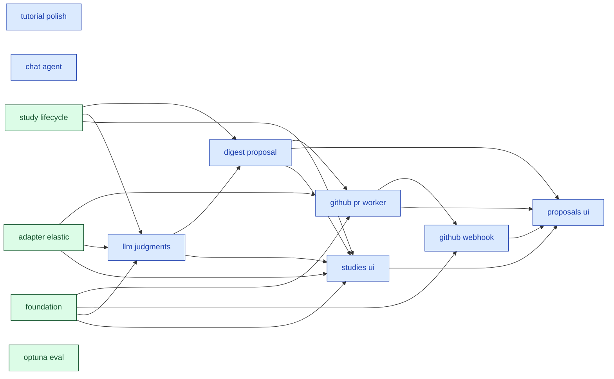

# RelyLoop MVP1 Dashboard

_Reflects feature-folder state as of **2026-05-11** (latest mtime of any planned/implemented feature `.md` file). Regenerated by `make dashboard` and the `mvp1-dashboard-regen` pre-commit hook. For the rich local view (filter chips, type colors), open [`mvp1_dashboard.html`](mvp1_dashboard.html) in a browser._

## MVP1 Progress

| Metric | Value |
|---|---|
| Features done | **4 / 12** (33%) |
| Path to MVP1 | **17** items remaining (features + bugs + chores) |
| Open bugs | 2 |
| Open chores | 7 (idea-stage debt) |
| Backlog ideas | 4 idea-only feat/infra (not yet scoped into MVP1) |
| In flight | 0 feature(s) actively shipping |

## Pipeline

### Done (4)

| Feature | Type | One-liner | Depends on | Status |
|---|---|---|---|---|
| [feat_study_lifecycle](implemented_features/2026_05_10_feat_study_lifecycle/feature_spec.md) | Feature | A relevance engineer creates a study via API or chat, the orchestrator enqueues N parallel `run_trial` jobs, trials accumulate in real time on the study detail page, the orchestrator detects stop-cond | — | [PR #18](https://github.com/SoundMindsAI/relyloop/pull/18) merged 2026-05-10 |
| [infra_adapter_elastic](implemented_features/2026_05_10_infra_adapter_elastic/feature_spec.md) | Infra | A single `ElasticAdapter` implements the `SearchAdapter` Protocol and serves both Elasticsearch (8.11+ / 9.x) and OpenSearch (2.x / 3.x), distinguished by a `engine_type` column. | — | [PR #16](https://github.com/SoundMindsAI/relyloop/pull/16) merged 2026-05-10 |
| [infra_foundation](implemented_features/2026_05_09_infra_foundation/feature_spec.md) | Infra | A relevance engineer can `git clone`, `docker compose up`, see all subsystems healthy in <60s on a 16GB laptop, and have a CI pipeline that gates every PR on lint, type-check, test, and an 80% coverag | — | [PR #4](https://github.com/SoundMindsAI/relyloop/pull/4) merged 2026-05-09 |
| [infra_optuna_eval](implemented_features/2026_05_10_infra_optuna_eval/feature_spec.md) | Infra | Optuna RDB storage co-tenants with the application Postgres; TPE sampler + median pruner are the MVP1 defaults; pytrec_eval scores trials against judgment lists for nDCG@k, MAP, P@k, recall@k, and MRR | — | [PR #23](https://github.com/SoundMindsAI/relyloop/pull/23) merged 2026-05-10 |

### Implementing (0)

_None._

### Plan (0)

_None._

### Spec (8)

| Feature | Type | One-liner | Depends on | Status |
|---|---|---|---|---|
| [feat_chat_agent](../02_product/planned_features/feat_chat_agent/feature_spec.md) | Feature | A chat surface at `/chat/{conversation_id}` streams OpenAI completions via SSE. | — | Draft |
| [feat_digest_proposal](../02_product/planned_features/feat_digest_proposal/feature_spec.md) | Feature | When a study transitions to `completed`, the digest worker generates: a narrative summary (LLM-authored), a parameter-importance map (computed by `optuna.importance`), and a recommended config. | `feat_study_lifecycle` `feat_llm_judgments` | Draft |
| [feat_github_pr_worker](../02_product/planned_features/feat_github_pr_worker/feature_spec.md) | Feature | `POST /api/v1/proposals/{id}/open_pr` enqueues a Git worker job that clones the configured repo, edits `*.params.json`, commits with a structured message, pushes a branch, opens a GitHub PR, attaches  | `infra_foundation` `infra_adapter_elastic` `feat_digest_proposal` | Draft |
| [feat_github_webhook](../02_product/planned_features/feat_github_webhook/feature_spec.md) | Feature | GitHub posts to `POST /webhooks/github` with HMAC-SHA256 signature; the receiver verifies the signature, looks up the proposal by `pr_url`, updates `pr_state` and `pr_merged_at`. | `infra_foundation` `feat_github_pr_worker` | Draft |
| [feat_llm_judgments](../02_product/planned_features/feat_llm_judgments/feature_spec.md) | Feature | A relevance engineer selects a query set + cluster + target + rubric and the system runs the current template to fetch top-K hits per query, asks OpenAI to rate each (query, doc) on a 0–3 scale with r | `infra_foundation` `infra_adapter_elastic` `feat_study_lifecycle` | Draft |
| [feat_proposals_ui](../02_product/planned_features/feat_proposals_ui/feature_spec.md) | Feature | Two routes — `/proposals` (filterable list) and `/proposals/{id}` (config diff + metric delta + "Open PR" button + post-open PR-state mirror) — plug into the existing `feat_studies_ui` Next.js app. | `feat_studies_ui` `feat_digest_proposal` `feat_github_pr_worker` `feat_github_webhook` | Draft |
| [feat_studies_ui](../02_product/planned_features/feat_studies_ui/feature_spec.md) | Feature | A Next.js app provides 9 of the 11 MVP1 routes from [`ui-architecture.md` §"Routes (MVP1)"](../../../01_architecture/ui-architecture.md): dashboard, clusters list/detail, query sets list/detail, judgm | `infra_foundation` `feat_study_lifecycle` `feat_digest_proposal` `feat_llm_judgments` `infra_adapter_elastic` | Draft |
| [chore_tutorial_polish](../02_product/planned_features/chore_tutorial_polish/feature_spec.md) | Chore | The release tag `v0.1.0` is pushed with: a worked tutorial at `docs/08_guides/tutorial-first-study.md`, sample data (50-query set + pre-baked judgment list + sample ES index of ~1,000 docs), README po | — | Draft |

### Idea (13)

| Feature | Type | One-liner | Depends on | Status |
|---|---|---|---|---|
| [infra_arq_subprocess_test](../02_product/planned_features/infra_arq_subprocess_test/idea.md) | Infra | Idea (deferred from `feat_study_lifecycle` Phase 2 / PR #25 final GPT-5.5 review) | — | Idea (deferred from `feat_study_lifecycle` Phase 2 / PR #25 final GPT-5.5 review) |
| [infra_ci_smoke_makeup](../02_product/planned_features/infra_ci_smoke_makeup/idea.md) | Infra | CI runs `make test-unit && make test-integration && make test-contract` against a service-container Postgres on `localhost:5432` — a synthetic environment that masks every real-world `make up` failure | — | Idea — captured during `infra_foundation` PR #4 first-run testing |
| [infra_frontend_stack_refresh](../02_product/planned_features/infra_frontend_stack_refresh/idea.md) | Infra | The frontend stack landed during `infra_foundation` is already 1–2 majors behind across the board. Specifically (locked → npm latest as of 2026-05-09): | — | Idea — surfaced during dependency audit on `feature/infra-foundation` |
| [infra_per_trial_timeout](../02_product/planned_features/infra_per_trial_timeout/idea.md) | Infra | `Settings.studies_default_timeout_s` (Story 1.5) is defined but never consumed at runtime. The intended semantic is: when `studies.config.trial_timeout_s` is absent, the worker should still bound the  | — | Idea (deferred from `feat_study_lifecycle` Phase 2 / PR #25 GPT-5.5 review cycle 2) |
| [chore_infra_optuna_eval_spec_text_drift](../02_product/planned_features/chore_infra_optuna_eval_spec_text_drift/idea.md) | Chore | The `infra_optuna_eval` feature spec at [`feature_spec.md`](../infra_optuna_eval/feature_spec.md) has internal drift between §11 and §14 about the partial-failure retry contract: | — | — |
| [chore_openapi_contract_validation](../02_product/planned_features/chore_openapi_contract_validation/idea.md) | Chore | Idea (deferred from `feat_study_lifecycle` Phase 2 / PR #25 final GPT-5.5 review) | — | Idea (deferred from `feat_study_lifecycle` Phase 2 / PR #25 final GPT-5.5 review) |
| [chore_spec_query_set_cluster_id_drift](../02_product/planned_features/chore_spec_query_set_cluster_id_drift/idea.md) | Chore | `docs/02_product/planned_features/feat_study_lifecycle/feature_spec.md` §7 FR-3 says: | — | — |
| [chore_spec_trial_created_at_drift](../02_product/planned_features/chore_spec_trial_created_at_drift/idea.md) | Chore | `feat_study_lifecycle/feature_spec.md` §7.4 defines wire values for the trials list `?sort=` query parameter: | — | — |
| [chore_starlette_422_deprecation](../02_product/planned_features/chore_starlette_422_deprecation/idea.md) | Chore | Starlette has renamed `HTTP_422_UNPROCESSABLE_ENTITY` to `HTTP_422_UNPROCESSABLE_CONTENT`. Three call sites still use the old name: | — | Idea — captured during `infra_foundation` Story 5.1 test backfill |
| [chore_test_both_engines](../02_product/planned_features/chore_test_both_engines/idea.md) | Chore | `backend/tests/integration/test_clusters_api.py` only registers an **Elasticsearch** cluster in every test: | — | Idea (deferred from `infra_adapter_elastic` — refactor sweep, 2026-05-09) |
| [chore_trial_summary_single_query](../02_product/planned_features/chore_trial_summary_single_query/idea.md) | Chore | [`backend/app/db/repo/trial.py:aggregate_trials_summary`](../../../../backend/app/db/repo/trial.py) currently issues two SQL statements: | — | — |
| [bug_capability_check_test_isolation](../02_product/planned_features/bug_capability_check_test_isolation/idea.md) | Bug | Idea (deferred from `infra_adapter_elastic` Story 5.1) | — | Idea (deferred from `infra_adapter_elastic` Story 5.1) |
| [bug_env_file_corrupted_during_session](../02_product/planned_features/bug_env_file_corrupted_during_session/idea.md) | Bug | The user's working `.env` (containing the OpenAI API key referenced by [`CLAUDE.md`](../../../CLAUDE.md) "Cross-model review policy") was renamed to `.env.old` during the agent's implementation sessio | — | Idea — captured during `infra_foundation` Story 4.4 implementation |

## Dependency graph

Scoped feat/infra/chore nodes only. Idea-stage debt is omitted.

---

Source of truth: feature folders under [`docs/02_product/planned_features/`](../02_product/planned_features/) and [`docs/00_overview/implemented_features/`](implemented_features/). See [`state.md`](../../state.md) for active-branch context and [`CLAUDE.md`](../../CLAUDE.md) for conventions.
