[← Roadmap overview](DASHBOARD.md)

# RelyLoop MVP1 Dashboard

_Reflects feature-folder state as of **2026-05-25** (latest mtime of any planned/implemented feature `.md` file). Regenerated by `make dashboard` and the `mvp1-dashboard-regen` pre-commit hook. For the rich local view (filter chips, type colors), open [`mvp1_dashboard.html`](mvp1_dashboard.html) in a browser._

## Next up

All scoped MVP1 features shipped 🎉

Pull from the Idea backlog or capture a new feature spec.

## MVP1 Progress

| Metric | Value |
|---|---|
| Scoped items done | **75 / 75** (100%) — feat_/infra_/chore_/epic_ past idea stage |
| Pending work | **15** items (every not-done feat/infra/chore/bug across all priorities) |
| → P0 — do next | **0** unblocking / paying daily cost |
| → P1 | **0** high-value, ready when P0 clears |
| → P2 (default) | 14 important to file, not blocking |
| → Backlog | 1 captured for record, not planned |
| Open bugs | 4 |
| Legacy "Path to MVP1" | 11 items — scoped-not-done + bugs + chore-ideas only (excludes feat/infra ideas) |
| Backlog ideas | 4 idea-only feat/infra (not yet scoped into MVP1) |
| In flight | 0 feature(s) actively shipping |

## Pipeline

### Done (93)

| Feature | Type | One-liner | Depends on | Status |
|---|---|---|---|---|
| [feat_agent_propose_search_space](implemented_features/2026_05_21_feat_agent_propose_search_space/feature_spec.md) | Feature | A new read-only agent tool `propose_search_space(template_id, cluster_id, judgment_list_id?, prior_study_id?) → SearchSpace JSON` that emits a deterministic, code-generated search space using the same | — | [PR #175](https://github.com/SoundMindsAI/relyloop/pull/175) merged 2026-05-21 |
| [feat_auto_followup_studies](implemented_features/2026_05_24_feat_auto_followup_studies/feature_spec.md) | Feature | A relevance engineer can opt into auto-chaining on a per-study basis by setting `studies.config.auto_followup_depth` in the create-study wizard (or the `create_study` agent tool). | — | [PR #223](https://github.com/SoundMindsAI/relyloop/pull/223) merged 2026-05-24 |
| [feat_chat_agent](implemented_features/2026_05_12_feat_chat_agent/feature_spec.md) | Feature | A chat surface at `/chat/{conversation_id}` streams OpenAI completions via SSE. | `feat_digest_proposal` `feat_github_pr_worker` `feat_github_webhook` `feat_llm_judgments` `feat_proposals_ui` `feat_studies_ui` `feat_study_lifecycle` `infra_adapter_elastic` `infra_foundation` `infra_optuna_eval` | [PR #60](https://github.com/SoundMindsAI/relyloop/pull/60) merged 2026-05-12 |
| [feat_cluster_target_filter](implemented_features/2026_05_20_feat_cluster_target_filter/feature_spec.md) | Feature | Each registered cluster can optionally carry a glob pattern (`products*`, `team-a-*`, `docs-[ef][nr]-*`) that scopes `list_targets()` to the matching subset. | — | [PR #168](https://github.com/SoundMindsAI/relyloop/pull/168) merged 2026-05-20 |
| [feat_config_repo_baseline_tracking](implemented_features/2026_05_23_feat_config_repo_baseline_tracking/feature_spec.md) | Feature | A single denormalized FK `config_repos.last_merged_proposal_id` points at the most recently merged proposal for each config repo. | — | [PR #202](https://github.com/SoundMindsAI/relyloop/pull/202) merged 2026-05-23 |
| [feat_contextual_help](implemented_features/2026_05_15_feat_contextual_help/feature_spec.md) | Feature | a relevance engineer can launch their second study and interpret its digest without re-reading the tutorial, because every domain-jargon label has a one-click contextual definition grounded in the sam | — | [PR #122](https://github.com/SoundMindsAI/relyloop/pull/122) merged 2026-05-15 |
| [feat_create_study_search_space_builder](implemented_features/2026_05_20_feat_create_study_search_space_builder/feature_spec.md) | Feature | Complete (PR #163, squash commit `c703953`, merged 2026-05-20) | — | [PR #163](https://github.com/SoundMindsAI/relyloop/pull/163) merged 2026-05-20 |
| [feat_create_study_target_autocomplete](implemented_features/2026_05_20_feat_create_study_target_autocomplete/feature_spec.md) | Feature | Operator selects a cluster → an autocomplete dropdown lists the user-visible targets on that cluster (name + doc count), pre-sorted alphabetically. | — | [PR #165](https://github.com/SoundMindsAI/relyloop/pull/165) merged 2026-05-20 |
| [feat_data_table_primitive](implemented_features/2026_05_16_feat_data_table_primitive/feature_spec.md) | Feature | Complete (PR #126, merged 2026-05-16) | — | [PR #126](https://github.com/SoundMindsAI/relyloop/pull/126) merged 2026-05-16 |
| [feat_digest_executable_followups](implemented_features/2026_05_24_feat_digest_executable_followups/feature_spec.md) | Feature | The LLM emits a discriminated union (`narrow` \| `widen` \| `text`) for each followup with a structured `search_space` when applicable. | — | [PR #225](https://github.com/SoundMindsAI/relyloop/pull/225) merged 2026-05-24 |
| [feat_digest_executable_followups_swap_template](implemented_features/2026_05_24_feat_digest_executable_followups_swap_template/feature_spec.md) | Feature | The LLM emits a fourth `kind: "swap_template"` variant carrying `{rationale, template_id, search_space}` where `template_id` references a different `query_templates.id` than the parent study used. | — | [PR #232](https://github.com/SoundMindsAI/relyloop/pull/232) merged 2026-05-24 |
| [feat_digest_proposal](implemented_features/2026_05_11_feat_digest_proposal/feature_spec.md) | Feature | When a study transitions to `completed`, the digest worker generates: a narrative summary (LLM-authored), a parameter-importance map (computed by `optuna.importance`), and a recommended config. | `feat_study_lifecycle` `feat_llm_judgments` | [PR #41](https://github.com/SoundMindsAI/relyloop/pull/41) merged 2026-05-11 |
| [feat_github_pr_worker](implemented_features/2026_05_12_feat_github_pr_worker/feature_spec.md) | Feature | `POST /api/v1/proposals/{id}/open_pr` enqueues a Git worker job that clones the configured repo, edits `*.params.json`, commits with a structured message, pushes a branch, opens a GitHub PR, attaches  | `infra_foundation` `infra_adapter_elastic` `feat_study_lifecycle` `feat_digest_proposal` | [PR #45](https://github.com/SoundMindsAI/relyloop/pull/45) merged 2026-05-12 |
| [feat_github_webhook](implemented_features/2026_05_12_feat_github_webhook/feature_spec.md) | Feature | GitHub posts to `POST /webhooks/github` with HMAC-SHA256 signature; the receiver verifies the signature, looks up the proposal by `pr_url`, updates `pr_state` and `pr_merged_at`. | `infra_foundation` `infra_adapter_elastic` `feat_github_pr_worker` | [PR #56](https://github.com/SoundMindsAI/relyloop/pull/56) merged 2026-05-12 |
| [feat_home_demo_reseed_endpoint](implemented_features/2026_05_24_feat_home_demo_reseed_endpoint/feature_spec.md) | Feature | A dev-only `POST /api/v1/_test/demo/reseed` endpoint plus a "Reset to demo state" button inside `StartHereChecklist` that lets an operator wipe + re-seed the 4 demo scenarios from the browser. | — | [PR #228](https://github.com/SoundMindsAI/relyloop/pull/228) merged 2026-05-24 |
| [feat_home_first_run_demo_nudge](implemented_features/2026_05_22_feat_home_first_run_demo_nudge/feature_spec.md) | Feature | An operator landing on a freshly-seeded stack sees an unambiguous banner above the dashboard's empty/populated content that names the present demo clusters, explains they ship with realistic queries + | — | [PR #188](https://github.com/SoundMindsAI/relyloop/pull/188) merged 2026-05-22 |
| [feat_judgments_periodic_resume_sweep](implemented_features/2026_05_14_feat_judgments_periodic_resume_sweep/feature_spec.md) | Feature | A new Arq cron job `resume_stuck_judgment_lists` ticks every `RELYLOOP_JUDGMENTS_RESUME_SWEEP_MINUTES` minutes (default 15), re-enqueues every `judgment_lists.status='generating'` row via deterministi | — | [PR #104](https://github.com/SoundMindsAI/relyloop/pull/104) merged 2026-05-12 |
| [feat_llm_judgments](implemented_features/2026_05_11_feat_llm_judgments/feature_spec.md) | Feature | A relevance engineer selects a query set + cluster + target + rubric and the system runs the current template to fetch top-K hits per query, asks OpenAI to rate each (query, doc) on a 0–3 scale with r | `infra_foundation` `infra_adapter_elastic` `feat_study_lifecycle` | [PR #35](https://github.com/SoundMindsAI/relyloop/pull/35) merged 2026-05-11 |
| [feat_orchestrator_zero_streak_abort](implemented_features/2026_05_22_feat_orchestrator_zero_streak_abort/feature_spec.md) | Feature | Complete (PR #191, merged 2026-05-22 as squash `51ae4b3c`) | — | [PR #191](https://github.com/SoundMindsAI/relyloop/pull/191) merged 2026-05-22 |
| [feat_pr_metric_confidence](implemented_features/2026_05_21_feat_pr_metric_confidence/feature_spec.md) | Feature | Approvers reading a study-backed PR see a "## Confidence" section directly between the existing "## Metric delta" and "## Config diff" sections. | — | [PR #180](https://github.com/SoundMindsAI/relyloop/pull/180) merged 2026-05-21 |
| [feat_proposals_ui](implemented_features/2026_05_12_feat_proposals_ui/feature_spec.md) | Feature | Two routes — `/proposals` (filterable list) and `/proposals/{id}` (config diff + metric delta + "Open PR" button + post-open PR-state mirror) — plug into the existing `feat_studies_ui` Next.js app. | `feat_studies_ui` `feat_digest_proposal` `feat_github_pr_worker` `feat_github_webhook` | [PR #58](https://github.com/SoundMindsAI/relyloop/pull/58) merged 2026-05-12 |
| [feat_query_inline_crud](implemented_features/2026_05_14_feat_query_inline_crud/feature_spec.md) | Feature | A relevance engineer on the `/query-sets/[id]` page sees a paginated table of every query in the set with `query_text`, `reference_answer`, `query_metadata`, and a `judgment_count` derived field. | `infra_foundation` `infra_adapter_elastic` `feat_study_lifecycle` `feat_llm_judgments` `feat_studies_ui` | [PR #101](https://github.com/SoundMindsAI/relyloop/pull/101) merged 2026-05-14 |
| [feat_studies_ui](implemented_features/2026_05_12_feat_studies_ui/feature_spec.md) | Feature | A Next.js app provides 9 of the 11 MVP1 routes from [`ui-architecture.md` §"Routes (MVP1)"](../01_architecture/ui-architecture.md): dashboard, clusters list/detail, query sets list/detail, judgment re | `infra_foundation` `feat_study_lifecycle` `feat_digest_proposal` `feat_llm_judgments` `infra_adapter_elastic` | [PR #50](https://github.com/SoundMindsAI/relyloop/pull/50) merged 2026-05-12 |
| [feat_study_lifecycle](implemented_features/2026_05_10_feat_study_lifecycle/feature_spec.md) | Feature | A relevance engineer creates a study via API or chat, the orchestrator enqueues N parallel `run_trial` jobs, trials accumulate in real time on the study detail page, the orchestrator detects stop-cond | — | [PR #18](https://github.com/SoundMindsAI/relyloop/pull/18) merged 2026-05-10 |
| [feat_study_preflight_overlap_probe](implemented_features/2026_05_22_feat_study_preflight_overlap_probe/feature_spec.md) | Feature | `POST /api/v1/studies` issues a single bounded `ids`-existence query against the study's target asking "for the *first* query in the query set that has any judgments (chosen deterministically by `id A | — | [PR #193](https://github.com/SoundMindsAI/relyloop/pull/193) merged 2026-05-21 |
| [feat_study_target_judgment_mismatch_guard](implemented_features/2026_05_21_feat_study_target_judgment_mismatch_guard/feature_spec.md) | Feature | `POST /api/v1/studies` rejects the mismatch at create time with a specific machine-readable error code (`JUDGMENT_TARGET_MISMATCH`, 422). | — | [PR #184](https://github.com/SoundMindsAI/relyloop/pull/184) merged 2026-05-21 |
| [infra_adapter_elastic](implemented_features/2026_05_10_infra_adapter_elastic/feature_spec.md) | Infra | A single `ElasticAdapter` implements the `SearchAdapter` Protocol and serves both Elasticsearch (8.11+ / 9.x) and OpenSearch (2.x / 3.x), distinguished by a `engine_type` column. | — | [PR #16](https://github.com/SoundMindsAI/relyloop/pull/16) merged 2026-05-10 |
| [infra_ci_smoke_makeup](implemented_features/2026_05_13_infra_ci_smoke_makeup/idea.md) | Infra | CI runs `make test-unit && make test-integration && make test-contract` against a service-container Postgres on `localhost:5432` — a synthetic environment that masks every real-world `make up` failure | — | Complete |
| [infra_dashboard_regen_pre_commit_conflict](implemented_features/2026_05_14_infra_dashboard_regen_pre_commit_conflict/idea.md) | Infra | The pre-commit pipeline does: | — | Complete |
| [infra_e2e_seed_completed_study](implemented_features/2026_05_17_infra_e2e_seed_completed_study/idea.md) | Infra | `feat_contextual_help` Phase 1 ships 7 InfoTooltip placements on the digest panel ([`ui/src/components/studies/digest-panel.tsx`](../../ui/src/components/studies/digest-panel.tsx)) — five section labe | — | Complete |
| [infra_e2e_wire_seed_helper_into_studies_spec](implemented_features/2026_05_19_infra_e2e_wire_seed_helper_into_studies_spec/idea.md) | Infra | `infra_e2e_seed_completed_study` shipped `POST /api/v1/_test/studies/seed-completed` and the `seedStudyCompletedWithDigest` TypeScript helper. The two consuming E2E tests in `ui/tests/e2e/studies.spec | — | Complete |
| [infra_foundation](implemented_features/2026_05_09_infra_foundation/feature_spec.md) | Infra | A relevance engineer can `git clone`, `docker compose up`, see all subsystems healthy in <60s on a 16GB laptop, and have a CI pipeline that gates every PR on lint, type-check, test, and an 80% coverag | — | [PR #4](https://github.com/SoundMindsAI/relyloop/pull/4) merged 2026-05-09 |
| [infra_frontend_stack_refresh](implemented_features/2026_05_12_infra_frontend_stack_refresh/idea.md) | Infra | The frontend stack landed during `infra_foundation` is already 1–2 majors behind across the board. Specifically (locked → npm latest as of 2026-05-09): | — | Complete |
| [infra_ir_measures_migration](implemented_features/2026_05_23_infra_ir_measures_migration/feature_spec.md) | Infra | `backend/app/eval/scoring.py` uses `ir_measures` for IR evaluation; the public `score()` signature and persisted user-facing metric tokens (`ndcg@10`, `map@10`, `mrr`, `map`) are unchanged. | — | [PR #198](https://github.com/SoundMindsAI/relyloop/pull/198) merged 2026-05-23 |
| [infra_make_targets_split_backend_only](implemented_features/2026_05_14_infra_make_targets_split_backend_only/idea.md) | Infra | The current `Makefile` bundles backend (ruff, mypy) and frontend (prettier, eslint, tsc) tooling under each top-level target. Pre-fix shape was ([`Makefile:26-34` in the pre-PR-110 main](../../Makefil | — | Complete |
| [infra_nvmrc](implemented_features/2026_05_13_infra_nvmrc/idea.md) | Infra | - `ui/package.json` engines: `"node": ">=20.18"`, verified on Node 22.22.2 per `state.md`. - No `.nvmrc` file at repo root or under `ui/`. - Default shell may have an older nvm-active Node (Node 18 in | — | Complete |
| [infra_optuna_eval](implemented_features/2026_05_10_infra_optuna_eval/feature_spec.md) | Infra | Optuna RDB storage co-tenants with the application Postgres; TPE sampler + median pruner are the MVP1 defaults; ir_measures scores trials against judgment lists for nDCG@k, MAP, P@k, recall@k, and MRR | — | [PR #23](https://github.com/SoundMindsAI/relyloop/pull/23) merged 2026-05-10 |
| [infra_per_trial_timeout](implemented_features/2026_05_13_infra_per_trial_timeout/idea.md) | Infra | `Settings.studies_default_timeout_s` (Story 1.5) is defined but never consumed at runtime. The intended semantic is: when `studies.config.trial_timeout_s` is absent, the worker should still bound the  | — | Complete |
| [infra_structlog_test_helpers](implemented_features/2026_05_14_infra_structlog_test_helpers/idea.md) | Infra | The repo currently has two distinct, half-overlapping patterns for asserting structlog events from tests: | — | Complete |
| [infra_uv_sync_drops_precommit](implemented_features/2026_05_21_infra_uv_sync_drops_precommit/idea.md) | Infra | Complete | — | Complete |
| [chore_chat_last_message_preview](implemented_features/2026_05_14_chore_chat_last_message_preview/idea.md) | Chore | The `/chat` list page renders each conversation row as `title + relative timestamp (created_at) + count` via [`ui/src/components/chat/conversation-list.tsx:30-49`](../ui/src/components/chat/conversati | — | Complete |
| [chore_ci_gitignore_paths_ignore_gap](implemented_features/2026_05_13_chore_ci_gitignore_paths_ignore_gap/idea.md) | Chore | `.github/workflows/pr.yml` has a `paths-ignore` filter that skips the entire workflow when *every* changed path matches: | — | Complete |
| [chore_ci_gitleaks_workflow_step](implemented_features/2026_05_13_chore_ci_gitleaks_workflow_step/idea.md) | Chore | Gitleaks runs only as a pre-commit hook locally. Pre-commit is opt-in (the contributor must run `pre-commit install`); on a fresh clone or a contributor who skips the install, nothing scans commit con | — | Complete |
| [chore_ci_prettier_check](implemented_features/2026_05_19_chore_ci_prettier_check/idea.md) | Chore | `.github/workflows/pr.yml`'s `frontend` job runs: | — | Complete |
| [chore_cluster_delete_ui](implemented_features/2026_05_13_chore_cluster_delete_ui/idea.md) | Chore | The `/clusters` list page (Story 2.1) and `/clusters/{id}` detail page render registered clusters fine, but there is no Delete button. When an operator registers a cluster with stale credentials or a  | — | Complete |
| [chore_create_study_modal_e2e_stability](implemented_features/2026_05_20_chore_create_study_modal_e2e_stability/idea.md) | Chore | The Playwright smoke lane runs every `ui/tests/e2e/*.spec.ts` against a real-backend stack. The create-study modal's Step-1 cluster trigger (rendered by [`EntitySelect`](../../ui/src/components/common | — | [PR #161](https://github.com/SoundMindsAI/relyloop/pull/161) merged 2026-05-20 |
| [chore_create_study_wizard_polish](implemented_features/2026_05_20_chore_create_study_wizard_polish/feature_spec.md) | Chore | Step 4 auto-fills from the template's `declared_params` with conservative ranges, rejects unknown/missing params at create time with new machine-readable error codes, and surfaces four new glossary en | — | [PR #157](https://github.com/SoundMindsAI/relyloop/pull/157) merged 2026-05-20 |
| [chore_dashboard_pr_extraction_from_idea](implemented_features/2026_05_23_chore_dashboard_pr_extraction_from_idea/feature_spec.md) | Chore | Extend `_extract_pr_number` to accept the idea body as a fourth argument, and have `_load_implemented` read `idea.md` and pass it through. | — | [PR #221](https://github.com/SoundMindsAI/relyloop/pull/221) merged 2026-05-23 |
| [chore_data_table_columnvisibility_tanstack](implemented_features/2026_05_19_chore_data_table_columnvisibility_tanstack/idea.md) | Chore | `feat_data_table_primitive` shipped with six known non-regression follow-up items captured only in chat transcripts. None block the PR but each is a real improvement that would otherwise evaporate whe | — | Complete |
| [chore_detail_page_shell_primitive](implemented_features/2026_05_19_chore_detail_page_shell_primitive/idea.md) | Chore | Six of the seven `/{entity}/[id]` detail routes hand-roll the same three-state scaffold around their data query. The structure is **identical** down to the className strings, with two minor copy varia | — | Complete |
| [chore_digest_worker_narrow_except](implemented_features/2026_05_14_chore_digest_worker_narrow_except/idea.md) | Chore | … | — | Complete |
| [chore_e2e_test_rows_isolation](implemented_features/2026_05_21_chore_e2e_test_rows_isolation/feature_spec.md) | Chore | Every Playwright spec that creates rows registers them against a file-based cleanup registry (per-worker JSONL files); a `globalTeardown` hook in `playwright.config.ts` reads + merges + drains the reg | — | [PR #186](https://github.com/SoundMindsAI/relyloop/pull/186) merged 2026-05-21 |
| [chore_env_guard_extend_deny_pattern](implemented_features/2026_05_13_chore_env_guard_extend_deny_pattern/idea.md) | Chore | The shipped guard regex matches `(\.env(\.[^/]+)?\|\.envrc)$` — i.e. bare `.env`, dotted `.env.<x>`, and `.envrc`. It does **not** match plausible backup/rotation spellings that an editor or user-side  | — | Complete |
| [chore_extract_shadcn_select_test_mock](implemented_features/2026_05_19_chore_extract_shadcn_select_test_mock/idea.md) | Chore | A factor-and-share refactor was attempted during `chore_form_dropdown_primitive` post-implementation. I extracted the mock to `ui/src/__tests__/helpers/shadcn-select-mock.tsx` exporting `mockShadcnSel | — | Complete |
| [chore_form_dropdown_guide_screenshot_refresh](implemented_features/2026_05_19_chore_form_dropdown_guide_screenshot_refresh/idea.md) | Chore | Each affected guide has a Playwright spec at `ui/tests/e2e/guides/*.spec.ts` that captures screenshots when run against the real backend. The PR's UI changes produce different screenshots: | — | Complete |
| [chore_form_dropdown_primitive](implemented_features/2026_05_18_chore_form_dropdown_primitive/feature_spec.md) | Chore | Ready for Execution | — | [PR #126](https://github.com/SoundMindsAI/relyloop/pull/126) merged 2026-05-16 |
| [chore_guide_01_screenshot_refresh_target_filter](implemented_features/2026_05_21_chore_guide_01_screenshot_refresh_target_filter/idea.md) | Chore | The guide is still operationally correct — the new field is optional, defaults to null, and doesn't change the happy-path flow described in the guide. But: | — | Complete |
| [chore_guide_06_screenshot_refresh_confidence_panel](implemented_features/2026_05_22_chore_guide_06_screenshot_refresh_confidence_panel/idea.md) | Chore | The shipped guide-06 PNGs at [`ui/public/guides/06_create_and_monitor_study/`](../../ui/public/guides/06_create_and_monitor_study) were captured before the ConfidencePanel mounted on the studies-detai | — | Complete |
| [chore_guide_06_screenshot_refresh_target_picker](implemented_features/2026_05_21_chore_guide_06_screenshot_refresh_target_picker/idea.md) | Chore | The walkthrough guide 06 ("Create and monitor a study") shows the operator opening the create-study modal as part of the wizard tour. The single Step-1 screenshot now disagrees with shipped UI — opera | — | Complete |
| [chore_guides_faq](implemented_features/2026_05_22_chore_guides_faq/idea.md) | Chore | Tooltips and the glossary answer "**what does X mean?**" within a 1–2 sentence budget. They don't carry the operator-judgment-shaped questions that come up *after* the term is understood: | — | Complete |
| [chore_guides_glossary_route](implemented_features/2026_05_22_chore_guides_glossary_route/feature_spec.md) | Chore | the [`/guide`](../../ui/src/app/guide/page.tsx) catalog page gains a third section — **Glossary** — that renders every entry in a single browsable, searchable, deep-linkable page at `/guide/glossary`. | — | Draft |
| [chore_infra_foundation_github_token_file_retirement](implemented_features/2026_05_13_chore_infra_foundation_github_token_file_retirement/idea.md) | Chore | After `feat_github_pr_worker` ships, `GITHUB_TOKEN_FILE` is: | — | Complete |
| [chore_migration_test_head_brittleness](implemented_features/2026_05_23_chore_migration_test_head_brittleness/feature_spec.md) | Chore | Replace the two hardcoded `"0017"` literals with a dynamic `_current_head()` helper that shells out to `uv run alembic heads` and returns the current head revision id. | — | [PR #219](https://github.com/SoundMindsAI/relyloop/pull/219) merged 2026-05-23 |
| [chore_openapi_contract_validation](implemented_features/2026_05_13_chore_openapi_contract_validation/idea.md) | Chore | Complete | — | Complete |
| [chore_precommit_node_path_resolution](implemented_features/2026_05_21_chore_precommit_node_path_resolution/idea.md) | Chore | Every UI-touching commit fails at the eslint-ui pre-commit hook unless the developer remembers to inject the nvm Node into PATH manually. The error message is clear, but the friction is constant. | — | [PR #171](https://github.com/SoundMindsAI/relyloop/pull/171) merged 2026-05-21 |
| [chore_proposals_list_wire_param_e2e_test](implemented_features/2026_05_13_chore_proposals_list_wire_param_e2e_test/idea.md) | Chore | The `__tests__/app/proposals/page.test.tsx` suite covers AC-6 by asserting: | — | Complete |
| [chore_proposals_page_usememo_deps](implemented_features/2026_05_13_chore_proposals_page_usememo_deps/idea.md) | Chore | `pnpm lint` emits one new warning on the proposals list page: | — | Complete |
| [chore_proposals_source_filter_server_side](implemented_features/2026_05_13_chore_proposals_source_filter_server_side/idea.md) | Chore | The proposals list page at `/proposals` ships with a three-state source filter chip group (`all` / `study` / `manual`) shipped in `feat_proposals_ui` Story 1.2. Because the backend `GET /api/v1/propos | — | Complete |
| [chore_reconciler_terminal_closed_no_poll](implemented_features/2026_05_23_chore_reconciler_terminal_closed_no_poll/feature_spec.md) | Chore | Complete (PR #216, merged 2026-05-23, squash SHA `95d4c414`) | — | [PR #216](https://github.com/SoundMindsAI/relyloop/pull/216) merged 2026-05-23 |
| [chore_spec_trial_created_at_drift](implemented_features/2026_05_13_chore_spec_trial_created_at_drift/idea.md) | Chore | `feat_study_lifecycle/feature_spec.md` §7.4 defines wire values for the trials list `?sort=` query parameter: | — | Complete |
| [chore_starlette_422_deprecation](implemented_features/2026_05_13_chore_starlette_422_deprecation/idea.md) | Chore | Starlette has renamed `HTTP_422_UNPROCESSABLE_ENTITY` to `HTTP_422_UNPROCESSABLE_CONTENT`. Three call sites still use the old name: | — | Complete |
| [chore_study_default_stop_conditions](implemented_features/2026_05_23_chore_study_default_stop_conditions/feature_spec.md) | Chore | The wizard ships with `max_trials=200` pre-filled (typical 3–5 param case), a dimensionality-keyed preset selector (Focused 50 / Standard 200 / Deep 1000 / Custom) above the numeric fields, refreshed  | — | [PR #215](https://github.com/SoundMindsAI/relyloop/pull/215) merged 2026-05-23 |
| [chore_test_both_engines](implemented_features/2026_05_13_chore_test_both_engines/idea.md) | Chore | `backend/tests/integration/test_clusters_api.py` only registers an **Elasticsearch** cluster in every test: | — | Complete |
| [chore_trial_summary_single_query](implemented_features/2026_05_13_chore_trial_summary_single_query/idea.md) | Chore | [`backend/app/db/repo/trial.py:aggregate_trials_summary`](../../backend/app/db/repo/trial.py) currently issues two SQL statements: | — | Complete |
| [chore_tutorial_polish](implemented_features/2026_05_12_chore_tutorial_polish/feature_spec.md) | Chore | The release tag `v0.1.0` is pushed with: a worked tutorial at `docs/08_guides/tutorial-first-study.md`, sample data (50-query set + sample ES index of ~1,000 docs from the Amazon ESCI subset), README  | `feat_chat_agent` `feat_digest_proposal` `feat_github_pr_worker` `feat_github_webhook` `feat_llm_judgments` `feat_proposals_ui` `feat_studies_ui` `feat_study_lifecycle` `infra_adapter_elastic` `infra_foundation` `infra_optuna_eval` | [PR #64](https://github.com/SoundMindsAI/relyloop/pull/64) merged 2026-05-12 |
| [bug_capability_check_test_isolation](implemented_features/2026_05_12_bug_capability_check_test_isolation/idea.md) | Bug | Complete | — | Complete |
| [bug_contract_test_stub_missing_target_filter_kwarg](implemented_features/2026_05_23_bug_contract_test_stub_missing_target_filter_kwarg/idea.md) | Bug | `backend/tests/contract/test_error_codes.py::TestErrorCodes::test_targets_forbidden` and `::test_targets_unreachable_via_adapter` both define an inline `_Stub` class whose `list_targets` method has th | — | Complete |
| [bug_cursor_decode_value_validation](implemented_features/2026_05_17_bug_cursor_decode_value_validation/idea.md) | Bug | `backend/app/db/repo/_sort.py:decode_cursor()` performs a `json.loads(base64.urlsafe_b64decode(raw))` round-trip and then takes `decoded[0]` + `str(decoded[1])` without validating the payload shape or | — | Complete |
| [bug_dashboard_banner_dismiss_persistence_flake](implemented_features/2026_05_23_bug_dashboard_banner_dismiss_persistence_flake/idea.md) | Bug | The test, introduced by [PR #188 (`feat_home_first_run_demo_nudge`)](implemented_features/2026_05_22_feat_home_first_run_demo_nudge), is: | — | Complete |
| [bug_dashboard_classifier_half_step_releases](implemented_features/2026_05_23_bug_dashboard_classifier_half_step_releases/idea.md) | Bug | The MVP1.5 release tier was introduced 2026-05-23 via PR #200 (canonical release matrix + spec §27 + tech-stack.md). But the dashboard regen script's release classifier at… | — | Complete |
| [bug_dashboard_depends_on_column_bloat](implemented_features/2026_05_23_bug_dashboard_depends_on_column_bloat/idea.md) | Bug | [`scripts/build_mvp1_dashboard.py`](../../scripts/build_mvp1_dashboard.py) (2,084 lines) generates the "Depends on" column for each row in [`MVP1_DASHBOARD.md`](MVP1_DASHBOARD.md) and `mvp1_dashboard. | — | Complete |
| [bug_digest_param_importance_seam](implemented_features/2026_05_13_bug_digest_param_importance_seam/idea.md) | Bug | The test fixture builds its own `RDBStorage` via `build_storage(...)`, constructs sampler/pruner with `seed=42`, and calls `tell()` against THAT handle. The worker independently calls `build_storage(. | — | Complete |
| [bug_dockerfile_missing_prompts](implemented_features/2026_05_13_bug_dockerfile_missing_prompts/idea.md) | Bug | The `Dockerfile` at the repo root copies `backend/`, `migrations/`, `alembic.ini`, and `pyproject.toml` into `/app/` but does NOT copy `prompts/`. Any code that loads a file from `prompts/` at module- | — | Complete |
| [bug_e2e_target_dropdown_flake](implemented_features/2026_05_20_bug_e2e_target_dropdown_flake/idea.md) | Bug | The skipped test seeds two ES indices via Playwright's `request.put` (Node), opens the create-study modal, picks the seeded cluster via the cluster `<EntitySelect>`… | — | Complete |
| [bug_env_file_corrupted_during_session](implemented_features/2026_05_13_bug_env_file_corrupted_during_session/idea.md) | Bug | The user's working `.env` (containing the OpenAI API key referenced by [`CLAUDE.md`](../CLAUDE.md) "Cross-model review policy") was renamed to `.env.old` during the agent's implementation session.… | — | Complete |
| [bug_get_schema_unhandled_connect_error](implemented_features/2026_05_20_bug_get_schema_unhandled_connect_error/idea.md) | Bug | `ElasticAdapter.get_schema()` at [`backend/app/adapters/elastic.py:399-416`](../../backend/app/adapters/elastic.py#L399-L416) calls `_request(..., translate_errors=False)` and maps HTTP status codes e | — | Complete |
| [bug_judgment_lists_listing_ignores_query_set_filter](implemented_features/2026_05_20_bug_judgment_lists_listing_ignores_query_set_filter/idea.md) | Bug | The frontend hook at [`ui/src/lib/api/judgments.ts:37-46`](../../ui/src/lib/api/judgments.ts#L37-L46) (`useJudgmentLists`) passes `query_set_id` and `cluster_id` query parameters when listing judgment | — | Complete |
| [bug_judgment_template_default_params_contract](implemented_features/2026_05_13_bug_judgment_template_default_params_contract/idea.md) | Bug | The `query_templates` API endpoint stores `declared_params` as `dict[str, str]` (per [`backend/app/api/v1/schemas.py:202`](../../backend/app/api/v1/schemas.py) — `declared_params: dict[str, str] = Fie | — | Complete |
| [bug_openai_capability_check_incapable_on_valid_key](implemented_features/2026_05_24_bug_openai_capability_check_incapable_on_valid_key/feature_spec.md) | Bug | `/healthz` exposes which probe failed (specifically: surfaces `models_endpoint` status) and, when the failure was an HTTP error, the status code that triggered it (e.g., 401 → bad key; 429 → quota). | — | [PR #234](https://github.com/SoundMindsAI/relyloop/pull/234) merged 2026-05-24 |
| [bug_pr_reconciler_blocked_by_closed_fallback](implemented_features/2026_05_23_bug_pr_reconciler_blocked_by_closed_fallback/idea.md) | Bug | The GitHub webhook receiver at [`backend/app/api/webhooks/github.py:181-209`](../../backend/app/api/webhooks/github.py#L181-L209) handles the eventual-consistency case where GitHub delivers `pull_requ | — | Complete |
| [bug_query_inline_crud_since_filter_uuidv7_ms_collision](implemented_features/2026_05_14_bug_query_inline_crud_since_filter_uuidv7_ms_collision/idea.md) | Bug | The test ([`test_query_sets_router_queries.py:202-231`](../../backend/tests/integration/test_query_sets_router_queries.py#L202-L231)) seeds 5 queries via `_seed_set(5)`… | — | Complete |
| [bug_test_smoke_requires_env_vars](implemented_features/2026_05_13_bug_test_smoke_requires_env_vars/idea.md) | Bug | `backend/tests/unit/test_smoke.py::test_app_import` fails when run without `DATABASE_URL_FILE` and `POSTGRES_PASSWORD_FILE` env vars in the test environment: | — | Complete |
| [bug_worker_optuna_init_race](implemented_features/2026_05_13_bug_worker_optuna_init_race/idea.md) | Bug | Compose ordering: | — | Complete |

### Implementing (0)

_None._

### Plan (1)

| # | Priority | Feature | Type | One-liner | Depends on | Status |
|---|---|---|---|---|---|---|
| 1 | P2 | [bug_demo_clusters_unreachable_in_healthz](../02_product/planned_features/bug_demo_clusters_unreachable_in_healthz/feature_spec.md) | Bug | **After** the warmup task completes (typically within ~5 seconds of API startup, bounded by per-cluster `httpx` probe latency), `/healthz` reports the accurate `healthy` / `unreachable` aggregate for  | — | [PR #232](https://github.com/SoundMindsAI/relyloop/pull/232) |

### Spec (0)

_None._

### Idea (14)

| # | Priority | Feature | Type | One-liner | Depends on | Status |
|---|---|---|---|---|---|---|
| 1 | P2 | [feat_study_baseline_trial](../02_product/planned_features/feat_study_baseline_trial/idea.md) | Feature | `studies.baseline_metric` exists as a column on the `studies` table (declared in `feat_study_lifecycle` Phase 1, [`backend/app/db/models/study.py:76`](../../backend/app/db/models/study.py#L76)) with t | — | Idea — deferred Phase 2 work from `feat_pr_metric_confidence` (Phase 1 merged 2026-05-21 as PR #180 squash `d0a8358`). |
| 2 | P2 | [feat_study_clone_from_previous](../02_product/planned_features/feat_study_clone_from_previous/idea.md) | Feature | A relevance engineer's normal workflow after the first study completes: | — | Idea — surfaced during a UX review of parameter-tuning ergonomics on 2026-05-19. |
| 3 | P2 | [infra_agent_sibling_worktree_isolation](../02_product/planned_features/infra_agent_sibling_worktree_isolation/idea.md) | Infra | Running an autonomous agent in a sibling git worktree while the operator's main checkout has the Docker Compose stack up exposes two surfaces that aren't designed for parallel work: | — | Idea — tangential observations from the autonomous `chore_reconciler_terminal_closed_no_poll` agent run (PR #216, merged 2026-05-23) |
| 4 | P2 | [infra_study_preflight_real_engine_integration](../02_product/planned_features/infra_study_preflight_real_engine_integration/idea.md) | Infra | `feat_study_preflight_overlap_probe`'s integration tests (AC-1 through AC-4b in [`backend/tests/integration/test_studies_api.py`](../../backend/tests/integration/test_studies_api.py)) use… | — | Idea — surfaced during `feat_study_preflight_overlap_probe` (PR ___) phase-gate review |
| 5 | P2 | [chore_auto_followup_completed_parent_stop_chain_race](../02_product/planned_features/chore_auto_followup_completed_parent_stop_chain_race/idea.md) | Chore | The cycle-3 C3-1 cascade-cancel design tolerates terminal parents (cascade traverses through `completed` intermediates to reach in-flight descendants). But the FR-1 digest trigger fires `enqueue_follo | — | Idea — surfaced during the Epic 1+2 phase-gate GPT-5.5 review of `feat_auto_followup_studies` (cumulative-diff review finding F2, accepted in part as a future-work capture) |
| 6 | P2 | [chore_auto_followup_e2e_chain_seed_helper](../02_product/planned_features/chore_auto_followup_e2e_chain_seed_helper/idea.md) | Chore | `feat_auto_followup_studies` Story 3.3 specified a Playwright E2E spec that seeds a 3-node chain (root R → middle M → leaf L) and asserts: | — | Idea |
| 7 | P2 | [chore_dashboard_regen_quoted_pr_false_positive](../02_product/planned_features/chore_dashboard_regen_quoted_pr_false_positive/idea.md) | Chore | [`_extract_pr_number`](../../scripts/build_mvp1_dashboard.py#L572)'s priority-3 fuzzy match has two regexes: | — | Idea — surfaced during `chore_dashboard_pr_extraction_from_idea` empirical verification (2026-05-23) |
| 8 | P2 | [chore_e2e_seed_acme_idea_obsolete](../02_product/planned_features/chore_e2e_seed_acme_idea_obsolete/idea.md) | Chore | [`chore_e2e_seed_acme_helper_dead/idea.md`](../02_product/planned_features/chore_e2e_seed_acme_helper_dead/idea.md) (dated 2026-05-21) proposed two paths: | — | Idea — surfaced during `chore_migration_test_head_brittleness` `/idea-preflight` pick (2026-05-23) |
| 9 | P2 | [chore_studies_post_arq_spy_fixture](../02_product/planned_features/chore_studies_post_arq_spy_fixture/idea.md) | Chore | The studies POST handler at [`backend/app/api/v1/studies.py:307`](../../backend/app/api/v1/studies.py#L307) calls `await _enqueue_start_study(request, study_id)` after a successful create. The helper  | — | Idea — surfaced during `feat_study_preflight_overlap_probe` (PR ___) phase-gate review |
| 10 | P2 | [chore_template_library_expansion](../02_product/planned_features/chore_template_library_expansion/idea.md) | Chore | Three connected gaps: | — | Idea — surfaced during a UX review of parameter-tuning ergonomics on 2026-05-19. |
| 11 | P2 | [bug_dockerfile_missing_scripts_dir](../02_product/planned_features/bug_dockerfile_missing_scripts_dir/idea.md) | Bug | [`backend/app/services/demo_seeding.py:39`](../../backend/app/services/demo_seeding.py#L39) imports four constants from `scripts/seed_meaningful_demos.py`: | — | **Fixed** in PR #232 commit (this branch). Idea file captures the bug + the fix + the systemic lesson for future contributors. |
| 12 | P2 | [bug_markdown_doc_localstorage_undefined_jsdom](../02_product/planned_features/bug_markdown_doc_localstorage_undefined_jsdom/idea.md) | Bug | The afterEach hook unconditionally calls `window.localStorage.removeItem(...)` after each test, but `window.localStorage` is `undefined` in the test environment by the time the hook runs — either the  | — | Idea — captured during feat_digest_executable_followups implementation (Story 5.1 vitest sweep) |
| 13 | P2 | [bug_vitest_jsdom_localstorage_failures](../02_product/planned_features/bug_vitest_jsdom_localstorage_failures/idea.md) | Bug | `pnpm vitest run` on `feature/home-demo-reseed-endpoint` (and `main`) reports the following 4 files failing with the same root error: | — | open. |
| 14 | Backlog | [chore_e2e_seed_acme_helper_dead](../02_product/planned_features/chore_e2e_seed_acme_helper_dead/idea.md) | Chore | `seedAcmeProductsChain` is a 140-line helper that constructs a cluster + query_set + template + judgment_list + study + optional proposal/digest chain "Acme Products" demo scenario. The function is co | — | Idea — surfaced during `chore_e2e_test_rows_isolation` Story 1.2 coverage audit |

## Dependency graph

Scoped feat/infra/chore nodes only. Idea-stage debt is omitted.

```mermaid
graph LR
  classDef done fill:#dcfce7,stroke:#14532d,color:#14532d;
  classDef implement fill:#ffedd5,stroke:#9a3412,color:#9a3412;
  classDef plan fill:#fef9c3,stroke:#854d0e,color:#854d0e;
  classDef spec fill:#dbeafe,stroke:#1e40af,color:#1e40af;
  classDef idea fill:#f1f5f9,stroke:#334155,color:#334155;
  infra_foundation["foundation"]
  class infra_foundation done;
  feat_study_lifecycle["study lifecycle"]
  class feat_study_lifecycle done;
  infra_adapter_elastic["adapter elastic"]
  class infra_adapter_elastic done;
  infra_optuna_eval["optuna eval"]
  class infra_optuna_eval done;
  feat_digest_proposal["digest proposal"]
  class feat_digest_proposal done;
  feat_llm_judgments["llm judgments"]
  class feat_llm_judgments done;
  chore_tutorial_polish["tutorial polish"]
  class chore_tutorial_polish done;
  feat_chat_agent["chat agent"]
  class feat_chat_agent done;
  feat_github_pr_worker["github pr worker"]
  class feat_github_pr_worker done;
  feat_github_webhook["github webhook"]
  class feat_github_webhook done;
  feat_proposals_ui["proposals ui"]
  class feat_proposals_ui done;
  feat_studies_ui["studies ui"]
  class feat_studies_ui done;
  infra_frontend_stack_refresh["frontend stack refresh"]
  class infra_frontend_stack_refresh done;
  chore_ci_gitignore_paths_ignore_gap["ci gitignore paths ignore gap"]
  class chore_ci_gitignore_paths_ignore_gap done;
  chore_ci_gitleaks_workflow_step["ci gitleaks workflow step"]
  class chore_ci_gitleaks_workflow_step done;
  chore_cluster_delete_ui["cluster delete ui"]
  class chore_cluster_delete_ui done;
  chore_env_guard_extend_deny_pattern["env guard extend deny pattern"]
  class chore_env_guard_extend_deny_pattern done;
  chore_infra_foundation_github_token_file_retirement["infra foundation github token file retirement"]
  class chore_infra_foundation_github_token_file_retirement done;
  chore_openapi_contract_validation["openapi contract validation"]
  class chore_openapi_contract_validation done;
  chore_proposals_list_wire_param_e2e_test["proposals list wire param e2e test"]
  class chore_proposals_list_wire_param_e2e_test done;
  chore_proposals_page_usememo_deps["proposals page usememo deps"]
  class chore_proposals_page_usememo_deps done;
  chore_proposals_source_filter_server_side["proposals source filter server side"]
  class chore_proposals_source_filter_server_side done;
  chore_spec_trial_created_at_drift["spec trial created at drift"]
  class chore_spec_trial_created_at_drift done;
  chore_starlette_422_deprecation["starlette 422 deprecation"]
  class chore_starlette_422_deprecation done;
  chore_test_both_engines["test both engines"]
  class chore_test_both_engines done;
  chore_trial_summary_single_query["trial summary single query"]
  class chore_trial_summary_single_query done;
  infra_ci_smoke_makeup["ci smoke makeup"]
  class infra_ci_smoke_makeup done;
  infra_nvmrc["nvmrc"]
  class infra_nvmrc done;
  infra_per_trial_timeout["per trial timeout"]
  class infra_per_trial_timeout done;
  chore_chat_last_message_preview["chat last message preview"]
  class chore_chat_last_message_preview done;
  chore_digest_worker_narrow_except["digest worker narrow except"]
  class chore_digest_worker_narrow_except done;
  feat_judgments_periodic_resume_sweep["judgments periodic resume sweep"]
  class feat_judgments_periodic_resume_sweep done;
  feat_query_inline_crud["query inline crud"]
  class feat_query_inline_crud done;
  infra_dashboard_regen_pre_commit_conflict["dashboard regen pre commit conflict"]
  class infra_dashboard_regen_pre_commit_conflict done;
  infra_make_targets_split_backend_only["make targets split backend only"]
  class infra_make_targets_split_backend_only done;
  infra_structlog_test_helpers["structlog test helpers"]
  class infra_structlog_test_helpers done;
  feat_contextual_help["contextual help"]
  class feat_contextual_help done;
  feat_data_table_primitive["data table primitive"]
  class feat_data_table_primitive done;
  infra_e2e_seed_completed_study["e2e seed completed study"]
  class infra_e2e_seed_completed_study done;
  chore_form_dropdown_primitive["form dropdown primitive"]
  class chore_form_dropdown_primitive done;
  chore_ci_prettier_check["ci prettier check"]
  class chore_ci_prettier_check done;
  chore_data_table_columnvisibility_tanstack["data table columnvisibility tanstack"]
  class chore_data_table_columnvisibility_tanstack done;
  chore_detail_page_shell_primitive["detail page shell primitive"]
  class chore_detail_page_shell_primitive done;
  chore_extract_shadcn_select_test_mock["extract shadcn select test mock"]
  class chore_extract_shadcn_select_test_mock done;
  chore_form_dropdown_guide_screenshot_refresh["form dropdown guide screenshot refresh"]
  class chore_form_dropdown_guide_screenshot_refresh done;
  infra_e2e_wire_seed_helper_into_studies_spec["e2e wire seed helper into studies spec"]
  class infra_e2e_wire_seed_helper_into_studies_spec done;
  chore_create_study_modal_e2e_stability["create study modal e2e stability"]
  class chore_create_study_modal_e2e_stability done;
  chore_create_study_wizard_polish["create study wizard polish"]
  class chore_create_study_wizard_polish done;
  feat_cluster_target_filter["cluster target filter"]
  class feat_cluster_target_filter done;
  feat_create_study_search_space_builder["create study search space builder"]
  class feat_create_study_search_space_builder done;
  feat_create_study_target_autocomplete["create study target autocomplete"]
  class feat_create_study_target_autocomplete done;
  chore_e2e_test_rows_isolation["e2e test rows isolation"]
  class chore_e2e_test_rows_isolation done;
  chore_guide_01_screenshot_refresh_target_filter["guide 01 screenshot refresh target filter"]
  class chore_guide_01_screenshot_refresh_target_filter done;
  chore_guide_06_screenshot_refresh_target_picker["guide 06 screenshot refresh target picker"]
  class chore_guide_06_screenshot_refresh_target_picker done;
  chore_precommit_node_path_resolution["precommit node path resolution"]
  class chore_precommit_node_path_resolution done;
  feat_agent_propose_search_space["agent propose search space"]
  class feat_agent_propose_search_space done;
  feat_pr_metric_confidence["pr metric confidence"]
  class feat_pr_metric_confidence done;
  feat_study_target_judgment_mismatch_guard["study target judgment mismatch guard"]
  class feat_study_target_judgment_mismatch_guard done;
  infra_uv_sync_drops_precommit["uv sync drops precommit"]
  class infra_uv_sync_drops_precommit done;
  chore_guide_06_screenshot_refresh_confidence_panel["guide 06 screenshot refresh confidence panel"]
  class chore_guide_06_screenshot_refresh_confidence_panel done;
  chore_guides_faq["guides faq"]
  class chore_guides_faq done;
  chore_guides_glossary_route["guides glossary route"]
  class chore_guides_glossary_route done;
  feat_home_first_run_demo_nudge["home first run demo nudge"]
  class feat_home_first_run_demo_nudge done;
  feat_orchestrator_zero_streak_abort["orchestrator zero streak abort"]
  class feat_orchestrator_zero_streak_abort done;
  feat_study_preflight_overlap_probe["study preflight overlap probe"]
  class feat_study_preflight_overlap_probe done;
  chore_dashboard_pr_extraction_from_idea["dashboard pr extraction from idea"]
  class chore_dashboard_pr_extraction_from_idea done;
  chore_migration_test_head_brittleness["migration test head brittleness"]
  class chore_migration_test_head_brittleness done;
  chore_reconciler_terminal_closed_no_poll["reconciler terminal closed no poll"]
  class chore_reconciler_terminal_closed_no_poll done;
  chore_study_default_stop_conditions["study default stop conditions"]
  class chore_study_default_stop_conditions done;
  feat_config_repo_baseline_tracking["config repo baseline tracking"]
  class feat_config_repo_baseline_tracking done;
  infra_ir_measures_migration["ir measures migration"]
  class infra_ir_measures_migration done;
  feat_auto_followup_studies["auto followup studies"]
  class feat_auto_followup_studies done;
  feat_digest_executable_followups["digest executable followups"]
  class feat_digest_executable_followups done;
  feat_digest_executable_followups_swap_template["digest executable followups swap template"]
  class feat_digest_executable_followups_swap_template done;
  feat_home_demo_reseed_endpoint["home demo reseed endpoint"]
  class feat_home_demo_reseed_endpoint done;
  feat_study_lifecycle --> feat_digest_proposal
  feat_llm_judgments --> feat_digest_proposal
  infra_foundation --> feat_llm_judgments
  infra_adapter_elastic --> feat_llm_judgments
  feat_study_lifecycle --> feat_llm_judgments
  feat_chat_agent --> chore_tutorial_polish
  feat_digest_proposal --> chore_tutorial_polish
  feat_github_pr_worker --> chore_tutorial_polish
  feat_github_webhook --> chore_tutorial_polish
  feat_llm_judgments --> chore_tutorial_polish
  feat_proposals_ui --> chore_tutorial_polish
  feat_studies_ui --> chore_tutorial_polish
  feat_study_lifecycle --> chore_tutorial_polish
  infra_adapter_elastic --> chore_tutorial_polish
  infra_foundation --> chore_tutorial_polish
  infra_optuna_eval --> chore_tutorial_polish
  feat_digest_proposal --> feat_chat_agent
  feat_github_pr_worker --> feat_chat_agent
  feat_github_webhook --> feat_chat_agent
  feat_llm_judgments --> feat_chat_agent
  feat_proposals_ui --> feat_chat_agent
  feat_studies_ui --> feat_chat_agent
  feat_study_lifecycle --> feat_chat_agent
  infra_adapter_elastic --> feat_chat_agent
  infra_foundation --> feat_chat_agent
  infra_optuna_eval --> feat_chat_agent
  infra_foundation --> feat_github_pr_worker
  infra_adapter_elastic --> feat_github_pr_worker
  feat_study_lifecycle --> feat_github_pr_worker
  feat_digest_proposal --> feat_github_pr_worker
  infra_foundation --> feat_github_webhook
  infra_adapter_elastic --> feat_github_webhook
  feat_github_pr_worker --> feat_github_webhook
  feat_studies_ui --> feat_proposals_ui
  feat_digest_proposal --> feat_proposals_ui
  feat_github_pr_worker --> feat_proposals_ui
  feat_github_webhook --> feat_proposals_ui
  infra_foundation --> feat_studies_ui
  feat_study_lifecycle --> feat_studies_ui
  feat_digest_proposal --> feat_studies_ui
  feat_llm_judgments --> feat_studies_ui
  infra_adapter_elastic --> feat_studies_ui
  infra_foundation --> feat_query_inline_crud
  infra_adapter_elastic --> feat_query_inline_crud
  feat_study_lifecycle --> feat_query_inline_crud
  feat_llm_judgments --> feat_query_inline_crud
  feat_studies_ui --> feat_query_inline_crud
```

---

Source of truth: feature folders under [`docs/02_product/planned_features/`](../02_product/planned_features/) and [`docs/00_overview/implemented_features/`](implemented_features/). See [`state.md`](../../state.md) for active-branch context and [`CLAUDE.md`](../../CLAUDE.md) for conventions.
