[← Roadmap overview](DASHBOARD.md)

# RelyLoop MVP2 Dashboard

_Reflects feature-folder state as of **2026-06-04** (latest mtime of any planned/implemented feature `.md` file). Regenerated by `make dashboard` and the `mvp1-dashboard-regen` pre-commit hook. For the rich local view (filter chips, type colors), open [`mvp2_dashboard.html`](mvp2_dashboard.html) in a browser._

## Next up

**[feat_apply_path_normalizer_declaration](planned_features/02_mvp2/feat_apply_path_normalizer_declaration/feature_spec.md)** — Feature, currently in **Plan**

> The winning normalizer ships as a **structured, language-agnostic manifest** in the config-repo PR — not just prose.

Plan approved; run /impl-execute to ship

```bash
/impl-execute docs/00_overview/planned_features/02_mvp2/feat_apply_path_normalizer_declaration/implementation_plan.md --all
```

## MVP2 Progress

| Metric | Value |
|---|---|
| Filed under MVP2 | **50** folders total (done + specced not-done + idea backlog + bugs) |
| Specced features done | **18 / 28** (64%) — of features *past the idea stage* (those with a spec); the idea backlog below is NOT in this denominator, so 100% ≠ release complete |
| Pending work | **30** items (every not-done feat/infra/chore/bug across all priorities) |
| → P0 — do next | **0** unblocking / paying daily cost |
| → P1 | **1** high-value, ready when P0 clears |
| → P2 (default) | 25 important to file, not blocking |
| → Backlog | 4 captured for record, not planned |
| Open bugs | 9 |
| Legacy "Path to MVP2" | 26 items — scoped-not-done + bugs + chore-ideas only (excludes feat/infra ideas) |
| Backlog ideas | 4 idea-only feat/infra (not yet scoped into MVP2) |
| In flight | 0 feature(s) actively shipping |

## Pipeline

### Done (20)

| Feature | Type | One-liner | Depends on | Status |
|---|---|---|---|---|
| [feat_contextual_help_mvp2](implemented_features/2026_05_15_feat_contextual_help_mvp2/idea.md) | Feature | Phase 1 covered the create-study modal + study-detail surface — the steepest onboarding cliff. Two clusters of surfaces remain that a relevance engineer encounters after running their first study: | — | [PR #124](https://github.com/SoundMindsAI/relyloop/pull/124) merged 2026-05-15 |
| [feat_demo_ubi_study_comparison](implemented_features/2026_05_30_feat_demo_ubi_study_comparison/feature_spec.md) | Feature | After this feature, the home-button reseed (and the | — | [PR #320](https://github.com/SoundMindsAI/relyloop/pull/320) merged 2026-05-30 |
| [feat_overnight_autopilot](implemented_features/2026_05_31_feat_overnight_autopilot/feature_spec.md) | Feature | an operator can (a) discover the overnight path while creating a study because the wizard control is reframed as a labeled "🌙 Run overnight (compound automatically)" toggle with explicit copy about th | — | [PR #343](https://github.com/SoundMindsAI/relyloop/pull/343) merged 2026-05-31 |
| [feat_overnight_final_solution](implemented_features/2026_06_04_feat_overnight_final_solution/feature_spec.md) | Feature | The wizard exposes a strategy choice alongside the existing depth: keep today's predictable `narrow` loop OR opt into `follow_suggestions`, which lets each chain link consume the parent digest's top * | — | [PR #440](https://github.com/SoundMindsAI/relyloop/pull/440) merged 2026-06-04 |
| [feat_overnight_final_solution_phase2](implemented_features/2026_06_04_feat_overnight_final_solution_phase2/feature_spec.md) | Feature | When the chain that this study belongs to has terminated (`stop_reason` ≠ `in_flight`) and has at least 2 links, a top-of-page **Overnight result card** mounts above `LinkedEntitiesRow` and compresses | — | [PR #442](https://github.com/SoundMindsAI/relyloop/pull/442) merged 2026-06-04 |
| [feat_overnight_studies_summary_card](implemented_features/2026_06_04_feat_overnight_studies_summary_card/feature_spec.md) | Feature | A "ran while you were away" card surfaces at the top of `/studies` when at least one overnight chain has completed since the operator's last visit. | — | [PR #444](https://github.com/SoundMindsAI/relyloop/pull/444) merged 2026-06-04 |
| [feat_proposal_full_param_space_view](implemented_features/2026_06_04_feat_proposal_full_param_space_view/feature_spec.md) | Feature | A new `<FullParamSpacePanel>` renders below `<ConfigDiffPanel>` on `/proposals/[id]`. | — | [PR #446](https://github.com/SoundMindsAI/relyloop/pull/446) merged 2026-06-04 |
| [feat_studies_convergence_visibility](implemented_features/2026_06_02_feat_studies_convergence_visibility/feature_spec.md) | Feature | The studies list shows a completed-trial count and a convergence badge (`Converged` / `Still improving` / `Too few trials`) per study, reusing the shipped classifier. | — | [PR #421](https://github.com/SoundMindsAI/relyloop/pull/421) merged 2026-06-02 |
| [feat_study_convergence_indicator](implemented_features/2026_06_01_feat_study_convergence_indicator/feature_spec.md) | Feature | Every completed study carries a plain-language **convergence verdict** — `converged` / `still_improving` / `too_few_trials` — backed by a best-metric-so-far curve. | — | [PR #352](https://github.com/SoundMindsAI/relyloop/pull/352) merged 2026-06-01 |
| [feat_study_sub_warmup_guard](implemented_features/2026_05_29_feat_study_sub_warmup_guard/feature_spec.md) | Feature | A non-blocking inline warning appears under the `max_trials` input whenever the derived preset is `custom` AND `max_trials < STUDIES_TPE_WARMUP_FLOOR (= 50)`, naming Focused/Standard as one-click reme | — | [PR #316](https://github.com/SoundMindsAI/relyloop/pull/316) merged 2026-05-29 |
| [feat_ubi_judgments](implemented_features/2026_05_29_feat_ubi_judgments/feature_spec.md) | Feature | Operators with the OpenSearch / ES UBI plugin installed (today; Solr's first-party `solr.UBIComponent` lights up with the sibling `infra_adapter_solr` MVP2 release) can derive judgments from real clic | — | [PR #317](https://github.com/SoundMindsAI/relyloop/pull/317) merged 2026-05-29 |
| [infra_adapter_solr](implemented_features/2026_05_31_infra_adapter_solr/feature_spec.md) | Infra | A single `SolrAdapter` implements the `SearchAdapter` Protocol against Apache Solr 9.x and 10.x (both SolrCloud and standalone), pivoting on a capability probe at construction time. | `feat_ubi_judgments` | [PR #336](https://github.com/SoundMindsAI/relyloop/pull/336) merged 2026-05-31 |
| [infra_generated_artifact_freshness_gate](implemented_features/2026_06_03_infra_generated_artifact_freshness_gate/feature_spec.md) | Infra | CI fails a PR whose committed `types.ts` does not match what the live OpenAPI schema would produce, and whose `ui/public/docs/*` copies do not match their `docs/08_guides/*` sources. | — | [PR #433](https://github.com/SoundMindsAI/relyloop/pull/433) merged 2026-06-03 |
| [infra_smoke_reseed_runtime_budget](implemented_features/2026_06_02_infra_smoke_reseed_runtime_budget/feature_spec.md) | Infra | The CI smoke job's Playwright run excludes `demo-ubi.spec.ts` via the existing `testIgnore` precedent in [`ui/playwright.config.ts:47-65`](../../../ui/playwright.config.ts#L47-L65), so the reseed-boun | — | [PR #424](https://github.com/SoundMindsAI/relyloop/pull/424) merged 2026-06-02 |
| [infra_solr_ci_readiness](implemented_features/2026_06_01_infra_solr_ci_readiness/feature_spec.md) | Infra | Post-2026-05-31, no full `pr.yml` run can go green on any branch. | — | [PR #367](https://github.com/SoundMindsAI/relyloop/pull/367) merged 2026-06-01 |
| [infra_solr_smoke_stability](implemented_features/2026_06_02_infra_solr_smoke_stability/feature_spec.md) | Infra | The `pr.yml` `smoke (operator-path tutorial flow)` job is red on every branch. | — | [PR #383](https://github.com/SoundMindsAI/relyloop/pull/383) merged 2026-06-01 |
| [chore_solr_cred_backfill_needs_api_restart](implemented_features/2026_06_01_chore_solr_cred_backfill_needs_api_restart/idea.md) | Chore | `scripts/install.sh` step 5a backfills a `local-solr:` entry into a **pre-existing** `./secrets/cluster_credentials.yaml`. That write is correct and idempotent. But the `api` (and `worker`) process re | — | [PR #365](https://github.com/SoundMindsAI/relyloop/pull/365) merged 2026-06-01 |
| [chore_template_library_expansion](implemented_features/2026_06_02_chore_template_library_expansion/feature_spec.md) | Chore | A curated, version-grounded **template library** of **6 runnable templates** (4 ES/OpenSearch: basic multi_match, function-score decay, bool-boosted, phrase rescore; 2 Solr: edismax basic, boost decay | — | [PR #416](https://github.com/SoundMindsAI/relyloop/pull/416) merged 2026-06-02 |
| [bug_backend_suite_nondeterministic_caplog_isolation](implemented_features/2026_06_01_bug_backend_suite_nondeterministic_caplog_isolation/idea.md) | Bug | Many backend unit tests assert on captured log records (`caplog` / a structlog capture fixture) and fail with empty-capture shapes (`assert []`, `assert 'x' in []`) when run in the full randomized sui | — | [PR #364](https://github.com/SoundMindsAI/relyloop/pull/364) merged 2026-06-01 |
| [bug_contract_allowlists_outdated_after_mvp2_features](implemented_features/2026_06_01_bug_contract_allowlists_outdated_after_mvp2_features/idea.md) | Bug | Three separate contract-test allowlists were not updated as features shipped through MVP2. Each is a "hand-maintained canonical list of valid values" that drifts when a feature adds new entries to the | — | [PR #364](https://github.com/SoundMindsAI/relyloop/pull/364) merged 2026-06-01 |

### Implementing (0)

_None._

### Plan (12)

| # | Priority | Feature | Type | One-liner | Depends on | Status |
|---|---|---|---|---|---|---|
| 1 | P1 | [feat_study_wizard_inline_judgment_generation](planned_features/02_mvp2/feat_study_wizard_inline_judgment_generation/feature_spec.md) | Feature |  | — | — |
| 2 | P2 | [feat_apply_path_normalizer_declaration](planned_features/02_mvp2/feat_apply_path_normalizer_declaration/feature_spec.md) | Feature | The winning normalizer ships as a **structured, language-agnostic manifest** in the config-repo PR — not just prose. | — | — |
| 3 | P2 | [feat_query_normalization_tuning](planned_features/02_mvp2/feat_query_normalization_tuning/feature_spec.md) | Feature | A template that opts in by declaring `query_normalizer` as a Categorical param gets the Optuna loop deciding empirically — on the operator's judgment set — whether lowercasing, trimming, or contractio | — | — |
| 4 | P2 | [feat_query_normalizer_typed_pipeline](planned_features/02_mvp2/feat_query_normalizer_typed_pipeline/feature_spec.md) | Feature | A new typed search-space member `NormalizerPipelineParam` lets a template declare an **ordered list of normalization steps**; the Optuna loop samples over the powerset of declared steps and proposes t | — | — |
| 5 | P2 | [feat_ubi_llm_study_comparison](planned_features/02_mvp2/feat_ubi_llm_study_comparison/feature_spec.md) | Feature | A single dedicated route `/studies/compare?a={id}&b={id}` renders the two studies side-by-side with a per-panel diff column: a sentence-level digest-narrative diff, a best-trial parameter table with s | — | [PR #320](https://github.com/SoundMindsAI/relyloop/pull/320) |
| 6 | P2 | [chore_arq_pool_aclose_deprecation](planned_features/02_mvp2/chore_arq_pool_aclose_deprecation/feature_spec.md) | Chore | Both call sites use `await arq_pool.aclose()`; no `DeprecationWarning` on shutdown; a regression guard asserts the async-correct form on both paths so a future edit cannot silently reintroduce `close( | — | — |
| 7 | P2 | [chore_cluster_detail_rung_badge](planned_features/02_mvp2/chore_cluster_detail_rung_badge/feature_spec.md) | Chore | The cluster-detail page surfaces a `<UbiRungBadge>` for the cluster, scoped by a user-selected (or auto-seeded) query set + target. | — | [PR #320](https://github.com/SoundMindsAI/relyloop/pull/320) |
| 8 | P2 | [chore_demo_seeding_integration_tests_rewrite](planned_features/02_mvp2/chore_demo_seeding_integration_tests_rewrite/feature_spec.md) | Chore | The 9 skipped cases are rewritten to the async "POST + poll-until-terminal" shape, the timeout case is re-homed to the worker layer, a new `AC-Async` case asserts the `running → complete` polling tran | — | [PR #286](https://github.com/SoundMindsAI/relyloop/pull/286) |
| 9 | P2 | [chore_studies_post_arq_spy_fixture](planned_features/02_mvp2/chore_studies_post_arq_spy_fixture/feature_spec.md) | Chore | A reusable `arq_pool_spy` integration fixture that records every `enqueue_job(name, *args)` call, letting studies-POST tests positively assert `spy.calls == []` on rejection and `spy.calls == [("start | — | — |
| 10 | P2 | [chore_ubi_reader_search_after_pagination](planned_features/02_mvp2/chore_ubi_reader_search_after_pagination/feature_spec.md) | Chore | A new engine-neutral `SearchAdapter.scan_all` cursor-scan lets `UbiReader` iterate the **entire** matching event/query stream for a window (subject to a caller ceiling), folding each page into the agg | — | [PR #413](https://github.com/SoundMindsAI/relyloop/pull/413) |
| 11 | P2 | [bug_baseline_phase_test_isolation](planned_features/02_mvp2/bug_baseline_phase_test_isolation/feature_spec.md) | Bug | The three `TestComputeBaselineWaitS` cases pass standalone — `.venv/bin/python -m pytest backend/tests/unit/workers/test_orchestrator_baseline_phase.py -p no:randomly` is all-green with no reliance on | — | — |
| 12 | P2 | [bug_judgment_header_omits_click_bucket](planned_features/02_mvp2/bug_judgment_header_omits_click_bucket/feature_spec.md) | Bug | The header renders all three buckets (`llm`, `human`, `click`) so the displayed terms sum to the displayed total count, making the doc-comment claim ("the UI's source-breakdown card now renders all th | — | — |

### Spec (0)

_None._

### Idea (18)

| # | Priority | Feature | Type | One-liner | Depends on | Status |
|---|---|---|---|---|---|---|
| 1 | P2 | [feat_overnight_final_solution_phase3](planned_features/02_mvp2/feat_overnight_final_solution_phase3/idea.md) | Feature | When `follow_suggestions` runs a 4-link chain, today's proposal-creation logic at [`backend/workers/orchestrator.py:693-740`](../backend/workers/orchestrator.py#L693-L740)… | — | Idea — deferred Phase 3 from `feat_overnight_final_solution` Phase 1 spec |
| 2 | P2 | [infra_smoke_fork_pr_secret_skip](planned_features/02_mvp2/infra_smoke_fork_pr_secret_skip/idea.md) | Infra | `.github/workflows/pr.yml` triggers on `pull_request:` ([pr.yml:43](../.github/workflows/pr.yml)) — **not** `pull_request_target`. GitHub deliberately withholds repository secrets from workflows trigg | — | Idea — tangential discovery while merging PR #387 (`chore_arq_pool_aclose_deprecation`) |
| 3 | P2 | [chore_demo_reseed_partial_completion_fast_test](planned_features/02_mvp2/chore_demo_reseed_partial_completion_fast_test/idea.md) | Chore | `infra_solr_ci_readiness` made the demo reseed engine-tolerant: when an engine is unreachable, its scenario is skipped, the reseed completes with `status="complete"` and a non-empty `scenarios_skipped | — | Idea — tangential discovery during `infra_solr_ci_readiness` Story 1.2 implementation |
| 4 | P2 | [chore_e2e_overnight_strategy_radix_select_timing](planned_features/02_mvp2/chore_e2e_overnight_strategy_radix_select_timing/idea.md) | Chore | The Story 3.2 E2E spec walks the create-study wizard to Step 5, clicks the depth `<Select>` ("2 follow-ups"), and asserts the new Strategy `<Select>` becomes visible. In chromium against `pnpm dev`, t | — | Idea — tangential follow-up captured during `feat_overnight_final_solution` Story 3.2 implementation |
| 5 | P2 | [chore_overnight_result_card_screenshot](planned_features/02_mvp2/chore_overnight_result_card_screenshot/idea.md) | Chore | The `docs/08_guides/tutorial-first-study.md` Step 12 sub-section *"In the morning — read the overnight result card"* shipped on PR #442 with prose only — no… | — | Idea — deferred FR-9 deliverable from PR #442 |
| 6 | P2 | [chore_pr_yml_parallelize_backend_job](planned_features/02_mvp2/chore_pr_yml_parallelize_backend_job/idea.md) | Chore | `.github/workflows/pr.yml` has a job named `backend (lint + typecheck + tests + coverage)` that runs four sequential things in one job: ruff/lint, mypy, the full pytest matrix (unit + integration + co | — | Idea — captured during PR #426 CI watch |
| 7 | P2 | [chore_solr_post_pipeline_followups](planned_features/02_mvp2/chore_solr_post_pipeline_followups/idea.md) | Chore | The 13-story `infra_adapter_solr` execution surfaced several follow-on items that fit neither the original spec nor any sister feature folder. None block the MVP2 Solr release — they're operator-exper | — | Idea — tangential observations from `infra_adapter_solr` end-to-end |
| 8 | P2 | [chore_ubi_hybrid_template_render](planned_features/02_mvp2/chore_ubi_hybrid_template_render/idea.md) | Chore | Idea — contract decision deferred (NOT a worker bug) | — | Idea — contract decision deferred (NOT a worker bug) |
| 9 | P2 | [bug_e2e_teardown_chain_node_delete_500](planned_features/02_mvp2/bug_e2e_teardown_chain_node_delete_500/idea.md) | Bug | The E2E global-teardown deletes seeded rows in a fixed order (per `chore_e2e_test_rows_isolation` Story 1.2 cleanup registration). For auto-followup **chains**, the seeded nodes are `queued` studies c | — | Idea — tangential discovery during `feat_overnight_autopilot` (Story 4.2 E2E, PR forthcoming) |
| 10 | P2 | [bug_relyloop_spec_ubi_section_drift](planned_features/02_mvp2/bug_relyloop_spec_ubi_section_drift/idea.md) | Bug | [`docs/00_overview/relyloop-spec.md`](relyloop-spec.md) §"Click-derived judgments — OpenSearch UBI as the engine-neutral primary path" (line ~706) carries two staleness bugs from the 2026-05-27 releas | — | Idea — captured during `feat_ubi_judgments` preflight (2026-05-29) |
| 11 | P2 | [bug_reseed_failure_blocks_retry_arq_singleton_dedup](planned_features/02_mvp2/bug_reseed_failure_blocks_retry_arq_singleton_dedup/idea.md) | Bug | `run_demo_reseed` is enqueued with a fixed Arq job id `demo_reseed:singleton` (the singleton concurrency guard). When a run reaches a terminal state, Arq stores its **result** under `arq:result:demo_r | — | Idea — tangential discovery while verifying `fix(demo): add Solr (8983) to the reseed engine host-URL mapping` (branch `feat_demo_reseed_solr_and_steplog`) |
| 12 | P2 | [bug_seed_meaningful_demos_silent_bulk_errors](planned_features/02_mvp2/bug_seed_meaningful_demos_silent_bulk_errors/idea.md) | Bug | [`scripts/seed_meaningful_demos.py:917-935`](../../scripts/seed_meaningful_demos.py#L917-L935) bulk-indexes 1000 Amazon ESCI products into a dedicated index per demo scenario: | — | Idea — captured during `bug_smoke_seed_es_unavailable_shards_race` Phase 2.5 tangential sweep |
| 13 | P2 | [bug_studies_detail_vitest_intermittent_timeout](planned_features/02_mvp2/bug_studies_detail_vitest_intermittent_timeout/idea.md) | Bug | Under the full `pnpm test` run (`vitest run`, default worker pool), the Study-detail-page render test sometimes blocks past the 5 s `testTimeout` default — but the test itself is data-driven from mock | — | Idea — captured during `chore_template_library_expansion` post-impl tangential sweep |
| 14 | P2 | [bug_webhook_concurrent_merge_race_timing_sensitive](planned_features/02_mvp2/bug_webhook_concurrent_merge_race_timing_sensitive/idea.md) | Bug | Idea — surfaced during `bug_demo_clusters_unreachable_in_healthz` PR #236 CI. | — | Idea — surfaced during `bug_demo_clusters_unreachable_in_healthz` PR #236 CI. |
| 15 | Backlog | [feat_fts_rank_ordering](planned_features/02_mvp2/feat_fts_rank_ordering/idea.md) | Feature | `feat_data_table_primitive` shipped filter-only FTS — `?q=foo` matches rows where `search_vector @@ plainto_tsquery('english', 'foo')` is true but orders results by `created_at DESC, id DESC` (the def | — | Idea — deferred from `feat_data_table_primitive` (MVP1) per spec §16. |
| 16 | Backlog | [infra_arq_subprocess_test](planned_features/02_mvp2/infra_arq_subprocess_test/idea.md) | Infra | Idea (deferred from `feat_study_lifecycle` Phase 2 / PR #25 final GPT-5.5 review). Still applicable as of 2026-05-14: the three in-process tests cited below still cover the resume contract correctly;  | — | Idea (deferred from `feat_study_lifecycle` Phase 2 / PR #25 final GPT-5.5 review). Still applicable as of 2026-05-14: the three in-process tests cited below still cover the resume contract correctly; a subprocess test would add a narrow Arq-version-regression guard. |
| 17 | Backlog | [chore_auto_followup_parent_advisory_lock](planned_features/02_mvp2/chore_auto_followup_parent_advisory_lock/idea.md) | Chore | The shipped `feat_auto_followup_studies` worker uses a two-layer idempotency scheme: | — | Idea — captured as a standalone file to resolve broken cross-references in `feat_auto_followup_studies` D-11 + plan F2 + `bug_auto_followup_completed_parent_stop_chain_race/idea.md`. The slug was coined 2026-05-24 in D-11 but only existed as descriptive prose across other documents until now. |
| 18 | Backlog | [bug_chat_long_conversation_truncation](planned_features/02_mvp2/bug_chat_long_conversation_truncation/idea.md) | Bug | [`backend/app/services/agent_chat.send_user_message`](../../backend/app/services/agent_chat.py) defensively caps the OpenAI history at the most recent `HISTORY_MAX_MESSAGES = 100` messages… | — | Held for MVP2 (decided 2026-05-13). Folder renamed with `_mvp2` suffix to make the deferral visible at-a-glance in `ls docs/00_overview/planned_features/`. Resume work when MVP2 starts — no technical dependency on MVP2 infra (audit_log is N/A; Langfuse is convenience only); the deferral is scope discipline + zero current impact (latent bug, no operator has hit the 100-message cap). |

## Dependency graph

Scoped feat/infra/chore nodes only. Idea-stage debt is omitted.

```mermaid
graph LR
  classDef done fill:#dcfce7,stroke:#14532d,color:#14532d;
  classDef implement fill:#ffedd5,stroke:#9a3412,color:#9a3412;
  classDef plan fill:#fef9c3,stroke:#854d0e,color:#854d0e;
  classDef spec fill:#dbeafe,stroke:#1e40af,color:#1e40af;
  classDef idea fill:#f1f5f9,stroke:#334155,color:#334155;
  chore_arq_pool_aclose_deprecation["arq pool aclose deprecation"]
  class chore_arq_pool_aclose_deprecation plan;
  chore_cluster_detail_rung_badge["cluster detail rung badge"]
  class chore_cluster_detail_rung_badge plan;
  chore_demo_seeding_integration_tests_rewrite["demo seeding integration tests rewrite"]
  class chore_demo_seeding_integration_tests_rewrite plan;
  chore_studies_post_arq_spy_fixture["studies post arq spy fixture"]
  class chore_studies_post_arq_spy_fixture plan;
  chore_ubi_reader_search_after_pagination["ubi reader search after pagination"]
  class chore_ubi_reader_search_after_pagination plan;
  feat_apply_path_normalizer_declaration["apply path normalizer declaration"]
  class feat_apply_path_normalizer_declaration plan;
  feat_query_normalization_tuning["query normalization tuning"]
  class feat_query_normalization_tuning plan;
  feat_query_normalizer_typed_pipeline["query normalizer typed pipeline"]
  class feat_query_normalizer_typed_pipeline plan;
  feat_study_wizard_inline_judgment_generation["study wizard inline judgment generation"]
  class feat_study_wizard_inline_judgment_generation plan;
  feat_ubi_llm_study_comparison["ubi llm study comparison"]
  class feat_ubi_llm_study_comparison plan;
  feat_contextual_help_mvp2["contextual help mvp2"]
  class feat_contextual_help_mvp2 done;
  feat_study_sub_warmup_guard["study sub warmup guard"]
  class feat_study_sub_warmup_guard done;
  feat_ubi_judgments["ubi judgments"]
  class feat_ubi_judgments done;
  feat_demo_ubi_study_comparison["demo ubi study comparison"]
  class feat_demo_ubi_study_comparison done;
  feat_overnight_autopilot["overnight autopilot"]
  class feat_overnight_autopilot done;
  infra_adapter_solr["adapter solr"]
  class infra_adapter_solr done;
  chore_solr_cred_backfill_needs_api_restart["solr cred backfill needs api restart"]
  class chore_solr_cred_backfill_needs_api_restart done;
  feat_study_convergence_indicator["study convergence indicator"]
  class feat_study_convergence_indicator done;
  infra_solr_ci_readiness["solr ci readiness"]
  class infra_solr_ci_readiness done;
  chore_template_library_expansion["template library expansion"]
  class chore_template_library_expansion done;
  feat_studies_convergence_visibility["studies convergence visibility"]
  class feat_studies_convergence_visibility done;
  infra_smoke_reseed_runtime_budget["smoke reseed runtime budget"]
  class infra_smoke_reseed_runtime_budget done;
  infra_solr_smoke_stability["solr smoke stability"]
  class infra_solr_smoke_stability done;
  infra_generated_artifact_freshness_gate["generated artifact freshness gate"]
  class infra_generated_artifact_freshness_gate done;
  feat_overnight_final_solution["overnight final solution"]
  class feat_overnight_final_solution done;
  feat_overnight_final_solution_phase2["overnight final solution phase2"]
  class feat_overnight_final_solution_phase2 done;
  feat_overnight_studies_summary_card["overnight studies summary card"]
  class feat_overnight_studies_summary_card done;
  feat_proposal_full_param_space_view["proposal full param space view"]
  class feat_proposal_full_param_space_view done;
  feat_ubi_judgments --> infra_adapter_solr
```



---

Source of truth: feature folders under [`docs/00_overview/planned_features/`](planned_features/) and [`docs/00_overview/implemented_features/`](implemented_features/). See [`state.md`](../../state.md) for active-branch context and [`CLAUDE.md`](../../CLAUDE.md) for conventions.
