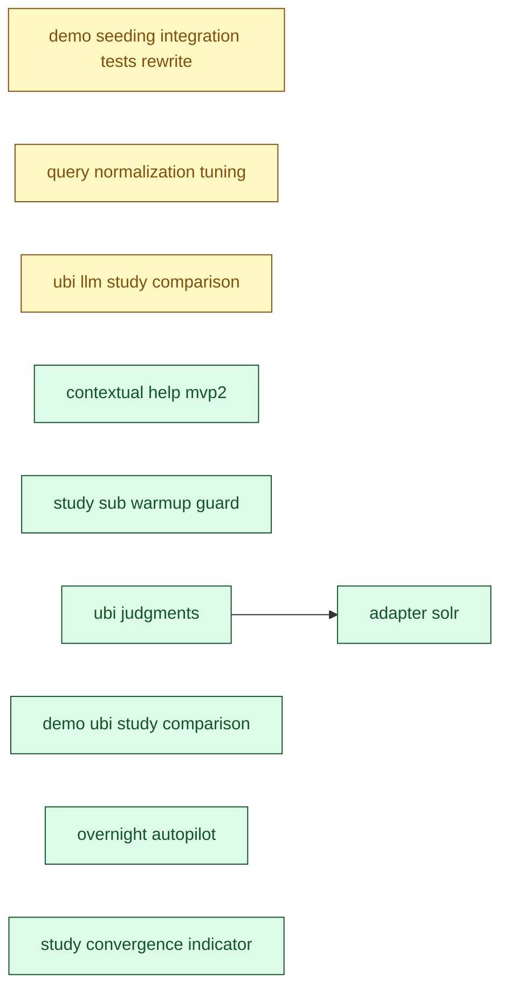

[← Roadmap overview](DASHBOARD.md)

# RelyLoop MVP2 Dashboard

_Reflects feature-folder state as of **2026-06-01** (latest mtime of any planned/implemented feature `.md` file). Regenerated by `make dashboard` and the `mvp1-dashboard-regen` pre-commit hook. For the rich local view (filter chips, type colors), open [`mvp2_dashboard.html`](mvp2_dashboard.html) in a browser._

## Next up

**[feat_query_normalization_tuning](planned_features/02_mvp2/feat_query_normalization_tuning/feature_spec.md)** — Feature, currently in **Plan**

> A template that opts in by declaring `query_normalizer` as a Categorical param gets the Optuna loop deciding empirically — on the operator's judgment set — whether lowercasing, trimming, or contraction expansion improves nDCG/MAP/MRR.

Plan approved; run /impl-execute to ship

```bash
/impl-execute docs/00_overview/planned_features/02_mvp2/feat_query_normalization_tuning/implementation_plan.md --all
```

## MVP2 Progress

| Metric | Value |
|---|---|
| Filed under MVP2 | **34** folders total (done + specced not-done + idea backlog + bugs) |
| Specced features done | **7 / 10** (70%) — of features *past the idea stage* (those with a spec); the idea backlog below is NOT in this denominator, so 100% ≠ release complete |
| Pending work | **27** items (every not-done feat/infra/chore/bug across all priorities) |
| → P0 — do next | **0** unblocking / paying daily cost |
| → P1 | **0** high-value, ready when P0 clears |
| → P2 (default) | 23 important to file, not blocking |
| → Backlog | 4 captured for record, not planned |
| Open bugs | 9 |
| Legacy "Path to MVP2" | 21 items — scoped-not-done + bugs + chore-ideas only (excludes feat/infra ideas) |
| Backlog ideas | 6 idea-only feat/infra (not yet scoped into MVP2) |
| In flight | 0 feature(s) actively shipping |

## Pipeline

### Done (7)

| Feature | Type | One-liner | Depends on | Status |
|---|---|---|---|---|
| [feat_contextual_help_mvp2](implemented_features/2026_05_15_feat_contextual_help_mvp2/idea.md) | Feature | Phase 1 covered the create-study modal + study-detail surface — the steepest onboarding cliff. Two clusters of surfaces remain that a relevance engineer encounters after running their first study: | — | [PR #124](https://github.com/SoundMindsAI/relyloop/pull/124) merged 2026-05-15 |
| [feat_demo_ubi_study_comparison](implemented_features/2026_05_30_feat_demo_ubi_study_comparison/feature_spec.md) | Feature | After this feature, the home-button reseed (and the | — | [PR #320](https://github.com/SoundMindsAI/relyloop/pull/320) merged 2026-05-30 |
| [feat_overnight_autopilot](implemented_features/2026_05_31_feat_overnight_autopilot/feature_spec.md) | Feature | an operator can (a) discover the overnight path while creating a study because the wizard control is reframed as a labeled "🌙 Run overnight (compound automatically)" toggle with explicit copy about th | — | [PR #343](https://github.com/SoundMindsAI/relyloop/pull/343) merged 2026-05-31 |
| [feat_study_convergence_indicator](implemented_features/2026_06_01_feat_study_convergence_indicator/feature_spec.md) | Feature | Every completed study carries a plain-language **convergence verdict** — `converged` / `still_improving` / `too_few_trials` — backed by a best-metric-so-far curve. | — | [PR #352](https://github.com/SoundMindsAI/relyloop/pull/352) merged 2026-06-01 |
| [feat_study_sub_warmup_guard](implemented_features/2026_05_29_feat_study_sub_warmup_guard/feature_spec.md) | Feature | A non-blocking inline warning appears under the `max_trials` input whenever the derived preset is `custom` AND `max_trials < STUDIES_TPE_WARMUP_FLOOR (= 50)`, naming Focused/Standard as one-click reme | — | [PR #316](https://github.com/SoundMindsAI/relyloop/pull/316) merged 2026-05-29 |
| [feat_ubi_judgments](implemented_features/2026_05_29_feat_ubi_judgments/feature_spec.md) | Feature | Operators with the OpenSearch / ES UBI plugin installed (today; Solr's first-party `solr.UBIComponent` lights up with the sibling `infra_adapter_solr` MVP2 release) can derive judgments from real clic | — | [PR #317](https://github.com/SoundMindsAI/relyloop/pull/317) merged 2026-05-29 |
| [infra_adapter_solr](implemented_features/2026_05_31_infra_adapter_solr/feature_spec.md) | Infra | A single `SolrAdapter` implements the `SearchAdapter` Protocol against Apache Solr 9.x and 10.x (both SolrCloud and standalone), pivoting on a capability probe at construction time. | `feat_ubi_judgments` | [PR #336](https://github.com/SoundMindsAI/relyloop/pull/336) merged 2026-05-31 |

### Implementing (0)

_None._

### Plan (3)

| # | Priority | Feature | Type | One-liner | Depends on | Status |
|---|---|---|---|---|---|---|
| 1 | P2 | [feat_query_normalization_tuning](planned_features/02_mvp2/feat_query_normalization_tuning/feature_spec.md) | Feature | A template that opts in by declaring `query_normalizer` as a Categorical param gets the Optuna loop deciding empirically — on the operator's judgment set — whether lowercasing, trimming, or contractio | — | — |
| 2 | P2 | [feat_ubi_llm_study_comparison](planned_features/02_mvp2/feat_ubi_llm_study_comparison/feature_spec.md) | Feature | A single dedicated route `/studies/compare?a={id}&b={id}` renders the two studies side-by-side with a per-panel diff column: a sentence-level digest-narrative diff, a best-trial parameter table with s | — | [PR #320](https://github.com/SoundMindsAI/relyloop/pull/320) |
| 3 | P2 | [chore_demo_seeding_integration_tests_rewrite](planned_features/02_mvp2/chore_demo_seeding_integration_tests_rewrite/feature_spec.md) | Chore | The 9 skipped cases are rewritten to the async "POST + poll-until-terminal" shape, the timeout case is re-homed to the worker layer, a new `AC-Async` case asserts the `running → complete` polling tran | — | [PR #286](https://github.com/SoundMindsAI/relyloop/pull/286) |

### Spec (0)

_None._

### Idea (24)

| # | Priority | Feature | Type | One-liner | Depends on | Status |
|---|---|---|---|---|---|---|
| 1 | P2 | [feat_apply_path_normalizer_declaration](planned_features/02_mvp2/feat_apply_path_normalizer_declaration/idea.md) | Feature | Phase 1 ships option (b) of the prod-reproducibility fork — the PR body documents the chosen normalizer and embeds a Python snippet, and the operator's merge contract is "you must replicate this norma | — | Idea — deferred Phase 3 of [`feat_query_normalization_tuning`](../feat_query_normalization_tuning/feature_spec.md) (§3 Phase boundaries, §19 D-1). Split into its own planned-features folder 2026-05-31 (was `feat_query_normalization_tuning/phase3_idea.md`). |
| 2 | P2 | [feat_overnight_studies_summary_card](planned_features/02_mvp2/feat_overnight_studies_summary_card/idea.md) | Feature | Phase 1 makes the overnight chain reviewable from the study detail page — but the operator has to know to go to *some* study in the chain. If they wake up and load `/studies`, the list looks identical | — | Idea — deferred Phase 2 work from [`feat_overnight_autopilot/feature_spec.md`](../feat_overnight_autopilot/feature_spec.md) §3 Phase boundaries. Split into its own planned-features folder 2026-05-31 (was `feat_overnight_autopilot/phase2_idea.md`). |
| 3 | P2 | [feat_query_normalizer_typed_pipeline](planned_features/02_mvp2/feat_query_normalizer_typed_pipeline/idea.md) | Feature | Phase 1 ships four built-in Categorical bundles, an English-only ASCII-apostrophe contraction dictionary, and a Python-only PR-body snippet. Three follow-on capabilities are deferred until operator si | — | Idea — deferred Phase 2 of [`feat_query_normalization_tuning`](../feat_query_normalization_tuning/feature_spec.md) (§3 Phase boundaries, §19 D-4 / D-6 / D-7). Split into its own planned-features folder 2026-05-31 (was `feat_query_normalization_tuning/phase2_idea.md`). |
| 4 | P2 | [infra_generated_artifact_freshness_gate](planned_features/02_mvp2/infra_generated_artifact_freshness_gate/idea.md) | Infra | - `ui/src/lib/types.ts` — regenerated from `http://localhost:8000/openapi.json` via `pnpm types:gen` (`ui/scripts/gen-types.mjs`). Nothing fails CI when a backend schema change lands without a matchin | — | Idea — tangential discovery during `feat_overnight_autopilot` (Story 2.1 + 4.1, PR forthcoming) |
| 5 | P2 | [chore_arq_pool_aclose_deprecation](planned_features/02_mvp2/chore_arq_pool_aclose_deprecation/idea.md) | Chore | [`backend/app/main.py`](../backend/app/main.py) (~line 144, the FastAPI lifespan/shutdown that closes the Arq Redis pool) calls `arq_pool.close()`. arq deprecated the sync-named `close()` in favor of  | — | Idea — tangential discovery during `feat_overnight_autopilot` (Epic 1 integration tests, PR forthcoming) |
| 6 | P2 | [chore_cluster_detail_rung_badge](planned_features/02_mvp2/chore_cluster_detail_rung_badge/idea.md) | Chore | The `<UbiRungBadge>` component ([`ui/src/components/clusters/ubi-rung-badge.tsx`](../ui/src/components/clusters/ubi-rung-badge.tsx)) renders the UBI-readiness rung (rung_0 → rung_3) for a cluster, but | — | Idea — split out from `feat_ubi_llm_study_comparison` §3 (out-of-scope decision) at spec generation |
| 7 | P2 | [chore_solr_cred_backfill_needs_api_restart](planned_features/02_mvp2/chore_solr_cred_backfill_needs_api_restart/idea.md) | Chore | `scripts/install.sh` step 5a backfills a `local-solr:` entry into a **pre-existing** `./secrets/cluster_credentials.yaml`. That write is correct and idempotent. But the `api` (and `worker`) process re | — | — |
| 8 | P2 | [chore_solr_post_pipeline_followups](planned_features/02_mvp2/chore_solr_post_pipeline_followups/idea.md) | Chore | The 13-story `infra_adapter_solr` execution surfaced several follow-on items that fit neither the original spec nor any sister feature folder. None block the MVP2 Solr release — they're operator-exper | — | Idea — tangential observations from `infra_adapter_solr` end-to-end |
| 9 | P2 | [chore_studies_post_arq_spy_fixture](planned_features/02_mvp2/chore_studies_post_arq_spy_fixture/idea.md) | Chore | The studies POST handler at [`backend/app/api/v1/studies.py:307`](../../backend/app/api/v1/studies.py#L307) calls `await _enqueue_start_study(request, study_id)` after a successful create. The helper  | — | Idea — surfaced during `feat_study_preflight_overlap_probe` (PR ___) phase-gate review |
| 10 | P2 | [chore_template_library_expansion](planned_features/02_mvp2/chore_template_library_expansion/idea.md) | Chore | Three connected gaps: | — | Idea — surfaced during a UX review of parameter-tuning ergonomics on 2026-05-19. |
| 11 | P2 | [chore_ubi_hybrid_template_render](planned_features/02_mvp2/chore_ubi_hybrid_template_render/idea.md) | Chore | Idea — contract decision deferred (NOT a worker bug) | — | Idea — contract decision deferred (NOT a worker bug) |
| 12 | P2 | [chore_ubi_reader_search_after_pagination](planned_features/02_mvp2/chore_ubi_reader_search_after_pagination/idea.md) | Chore | `UbiReader._scan_ubi_events` / `_scan_ubi_queries` each issue ONE `search_batch` (a `size`-limited query). To stay under the engine result-window they now cap at 10000 rows per (target, window).… | — | Idea — deferred from `feat_ubi_judgments` (found during the rung-3 E2E) |
| 13 | P2 | [bug_baseline_phase_test_isolation](planned_features/02_mvp2/bug_baseline_phase_test_isolation/idea.md) | Bug | `backend/tests/unit/workers/test_orchestrator_baseline_phase.py::TestComputeBaselineWaitS::*` fail when run in isolation with: | — | Idea — pre-existing bug surfaced during `feat_ubi_judgments` PR #317 |
| 14 | P2 | [bug_contract_allowlists_outdated_after_mvp2_features](planned_features/02_mvp2/bug_contract_allowlists_outdated_after_mvp2_features/idea.md) | Bug | Three separate contract-test allowlists were not updated as features shipped through MVP2. Each is a "hand-maintained canonical list of valid values" that drifts when a feature adds new entries to the | — | Idea — tangential discovery during `feat_study_convergence_indicator` pre-push gate |
| 15 | P2 | [bug_e2e_teardown_chain_node_delete_500](planned_features/02_mvp2/bug_e2e_teardown_chain_node_delete_500/idea.md) | Bug | The E2E global-teardown deletes seeded rows in a fixed order (per `chore_e2e_test_rows_isolation` Story 1.2 cleanup registration). For auto-followup **chains**, the seeded nodes are `queued` studies c | — | Idea — tangential discovery during `feat_overnight_autopilot` (Story 4.2 E2E, PR forthcoming) |
| 16 | P2 | [bug_judgment_header_omits_click_bucket](planned_features/02_mvp2/bug_judgment_header_omits_click_bucket/idea.md) | Bug | A judgment list generated from UBI (or hybrid UBI+LLM) carries non-zero `source_breakdown.click`, but the header's source-breakdown card silently drops it. Operators reviewing a UBI list see only the  | — | Idea — tangential discovery during `feat_overnight_autopilot` (Story 2.1, PR forthcoming) |
| 17 | P2 | [bug_relyloop_spec_ubi_section_drift](planned_features/02_mvp2/bug_relyloop_spec_ubi_section_drift/idea.md) | Bug | [`docs/00_overview/relyloop-spec.md`](relyloop-spec.md) §"Click-derived judgments — OpenSearch UBI as the engine-neutral primary path" (line ~706) carries two staleness bugs from the 2026-05-27 releas | — | Idea — captured during `feat_ubi_judgments` preflight (2026-05-29) |
| 18 | P2 | [bug_reseed_failure_blocks_retry_arq_singleton_dedup](planned_features/02_mvp2/bug_reseed_failure_blocks_retry_arq_singleton_dedup/idea.md) | Bug | `run_demo_reseed` is enqueued with a fixed Arq job id `demo_reseed:singleton` (the singleton concurrency guard). When a run reaches a terminal state, Arq stores its **result** under `arq:result:demo_r | — | Idea — tangential discovery while verifying `fix(demo): add Solr (8983) to the reseed engine host-URL mapping` (branch `feat_demo_reseed_solr_and_steplog`) |
| 19 | P2 | [bug_seed_meaningful_demos_silent_bulk_errors](planned_features/02_mvp2/bug_seed_meaningful_demos_silent_bulk_errors/idea.md) | Bug | [`scripts/seed_meaningful_demos.py:917-935`](../../scripts/seed_meaningful_demos.py#L917-L935) bulk-indexes 1000 Amazon ESCI products into a dedicated index per demo scenario: | — | Idea — captured during `bug_smoke_seed_es_unavailable_shards_race` Phase 2.5 tangential sweep |
| 20 | P2 | [bug_webhook_concurrent_merge_race_timing_sensitive](planned_features/02_mvp2/bug_webhook_concurrent_merge_race_timing_sensitive/idea.md) | Bug | Idea — surfaced during `bug_demo_clusters_unreachable_in_healthz` PR #236 CI. | — | Idea — surfaced during `bug_demo_clusters_unreachable_in_healthz` PR #236 CI. |
| 21 | Backlog | [feat_fts_rank_ordering](planned_features/02_mvp2/feat_fts_rank_ordering/idea.md) | Feature | `feat_data_table_primitive` shipped filter-only FTS — `?q=foo` matches rows where `search_vector @@ plainto_tsquery('english', 'foo')` is true but orders results by `created_at DESC, id DESC` (the def | — | Idea — deferred from `feat_data_table_primitive` (MVP1) per spec §16. |
| 22 | Backlog | [infra_arq_subprocess_test](planned_features/02_mvp2/infra_arq_subprocess_test/idea.md) | Infra | Idea (deferred from `feat_study_lifecycle` Phase 2 / PR #25 final GPT-5.5 review). Still applicable as of 2026-05-14: the three in-process tests cited below still cover the resume contract correctly;  | — | Idea (deferred from `feat_study_lifecycle` Phase 2 / PR #25 final GPT-5.5 review). Still applicable as of 2026-05-14: the three in-process tests cited below still cover the resume contract correctly; a subprocess test would add a narrow Arq-version-regression guard. |
| 23 | Backlog | [chore_auto_followup_parent_advisory_lock](planned_features/02_mvp2/chore_auto_followup_parent_advisory_lock/idea.md) | Chore | The shipped `feat_auto_followup_studies` worker uses a two-layer idempotency scheme: | — | Idea — captured as a standalone file to resolve broken cross-references in `feat_auto_followup_studies` D-11 + plan F2 + `bug_auto_followup_completed_parent_stop_chain_race/idea.md`. The slug was coined 2026-05-24 in D-11 but only existed as descriptive prose across other documents until now. |
| 24 | Backlog | [bug_chat_long_conversation_truncation](planned_features/02_mvp2/bug_chat_long_conversation_truncation/idea.md) | Bug | [`backend/app/services/agent_chat.send_user_message`](../../backend/app/services/agent_chat.py) defensively caps the OpenAI history at the most recent `HISTORY_MAX_MESSAGES = 100` messages… | — | Held for MVP2 (decided 2026-05-13). Folder renamed with `_mvp2` suffix to make the deferral visible at-a-glance in `ls docs/00_overview/planned_features/`. Resume work when MVP2 starts — no technical dependency on MVP2 infra (audit_log is N/A; Langfuse is convenience only); the deferral is scope discipline + zero current impact (latent bug, no operator has hit the 100-message cap). |

## Dependency graph

Scoped feat/infra/chore nodes only. Idea-stage debt is omitted.



---

Source of truth: feature folders under [`docs/00_overview/planned_features/`](planned_features/) and [`docs/00_overview/implemented_features/`](implemented_features/). See [`state.md`](../../state.md) for active-branch context and [`CLAUDE.md`](../../CLAUDE.md) for conventions.
