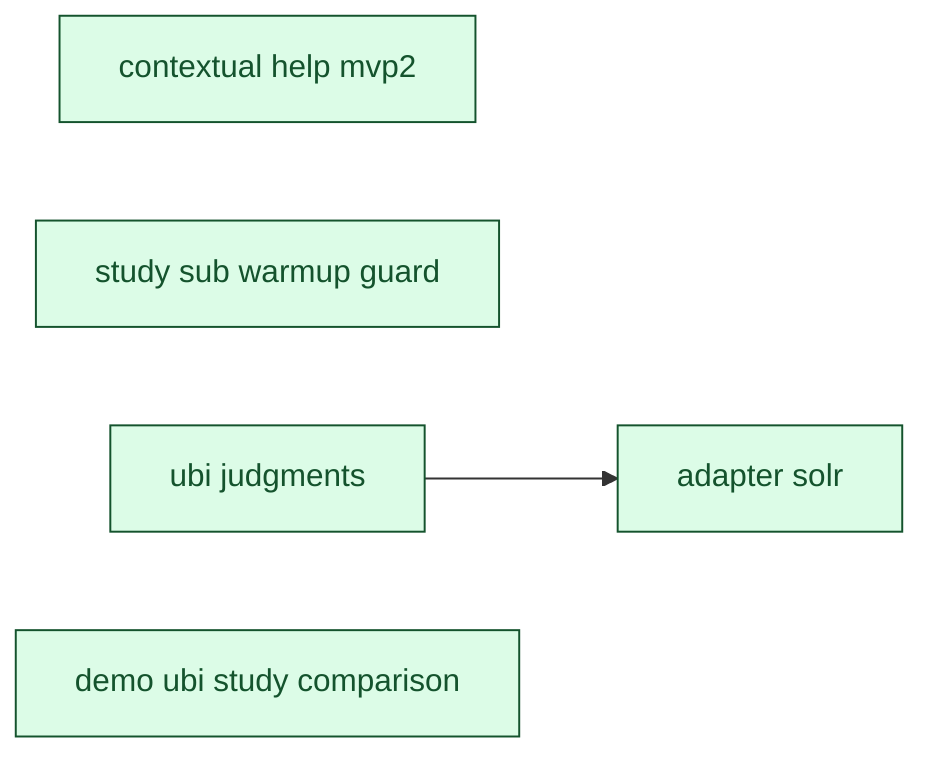

[← Roadmap overview](DASHBOARD.md)

# RelyLoop MVP2 Dashboard

_Reflects feature-folder state as of **2026-05-31** (latest mtime of any planned/implemented feature `.md` file). Regenerated by `make dashboard` and the `mvp1-dashboard-regen` pre-commit hook. For the rich local view (filter chips, type colors), open [`mvp2_dashboard.html`](mvp2_dashboard.html) in a browser._

## Next up

All scoped MVP2 features shipped 🎉

Pull from the Idea backlog or capture a new feature spec.

## MVP2 Progress

| Metric | Value |
|---|---|
| Filed under MVP2 | **20** folders total (done + specced not-done + idea backlog + bugs) |
| Specced features done | **5 / 5** (100%) — of features *past the idea stage* (those with a spec); the idea backlog below is NOT in this denominator, so 100% ≠ release complete |
| Pending work | **15** items (every not-done feat/infra/chore/bug across all priorities) |
| → P0 — do next | **0** unblocking / paying daily cost |
| → P1 | **0** high-value, ready when P0 clears |
| → P2 (default) | 11 important to file, not blocking |
| → Backlog | 4 captured for record, not planned |
| Open bugs | 3 |
| Legacy "Path to MVP2" | 9 items — scoped-not-done + bugs + chore-ideas only (excludes feat/infra ideas) |
| Backlog ideas | 6 idea-only feat/infra (not yet scoped into MVP2) |
| In flight | 0 feature(s) actively shipping |

## Pipeline

### Done (5)

| Feature | Type | One-liner | Depends on | Status |
|---|---|---|---|---|
| [feat_contextual_help_mvp2](implemented_features/2026_05_15_feat_contextual_help_mvp2/idea.md) | Feature | Phase 1 covered the create-study modal + study-detail surface — the steepest onboarding cliff. Two clusters of surfaces remain that a relevance engineer encounters after running their first study: | — | [PR #124](https://github.com/SoundMindsAI/relyloop/pull/124) merged 2026-05-15 |
| [feat_demo_ubi_study_comparison](implemented_features/2026_05_30_feat_demo_ubi_study_comparison/feature_spec.md) | Feature | After this feature, the home-button reseed (and the | — | [PR #320](https://github.com/SoundMindsAI/relyloop/pull/320) merged 2026-05-30 |
| [feat_study_sub_warmup_guard](implemented_features/2026_05_29_feat_study_sub_warmup_guard/feature_spec.md) | Feature | A non-blocking inline warning appears under the `max_trials` input whenever the derived preset is `custom` AND `max_trials < STUDIES_TPE_WARMUP_FLOOR (= 50)`, naming Focused/Standard as one-click reme | — | [PR #316](https://github.com/SoundMindsAI/relyloop/pull/316) merged 2026-05-29 |
| [feat_ubi_judgments](implemented_features/2026_05_29_feat_ubi_judgments/feature_spec.md) | Feature | Operators with the OpenSearch / ES UBI plugin installed (today; Solr's first-party `solr.UBIComponent` lights up with the sibling `infra_adapter_solr` MVP2 release) can derive judgments from real clic | — | [PR #317](https://github.com/SoundMindsAI/relyloop/pull/317) merged 2026-05-29 |
| [infra_adapter_solr](implemented_features/2026_05_31_infra_adapter_solr/feature_spec.md) | Infra | A single `SolrAdapter` implements the `SearchAdapter` Protocol against Apache Solr 9.x and 10.x (both SolrCloud and standalone), pivoting on a capability probe at construction time. | `feat_ubi_judgments` | [PR #336](https://github.com/SoundMindsAI/relyloop/pull/336) merged 2026-05-31 |

### Implementing (0)

_None._

### Plan (0)

_None._

### Spec (0)

_None._

### Idea (15)

| # | Priority | Feature | Type | One-liner | Depends on | Status |
|---|---|---|---|---|---|---|
| 1 | P2 | [feat_overnight_autopilot](planned_features/02_mvp2/feat_overnight_autopilot/idea.md) | Feature | The "Karpathy overnight loop" is already implemented and already autonomous, but an operator has no way to discover or trust it: | — | Idea — surfaced from an operator dogfooding review (2026-05-29). The autonomous-chaining *engine* already shipped; this is the ergonomics layer that makes it discoverable. |
| 2 | P2 | [feat_query_normalization_tuning](planned_features/02_mvp2/feat_query_normalization_tuning/idea.md) | Feature | A relevance pipeline runs in stages: (1) query understanding / normalization → (2) retrieval → (3) ranking / boosting → (4) re-ranking. RelyLoop tunes **stage 3 only**. But stage 1 is often where the  | — | Idea — scoped to MVP2 (moved from `00_unsure/` 2026-05-29). The core capability is small and fits the existing parameter model. One **gating design fork remains** — the prod-reproducibility question (below) — which `/spec-gen` must resolve; if no clean deployment path exists, this idea may be deferred out of MVP2 at spec time. Tracked as a release item rather than parked because the operator has a clear MVP2 intent and the theme fits the "Real Signals" / relevance-quality story. |
| 3 | P2 | [feat_study_convergence_indicator](planned_features/02_mvp2/feat_study_convergence_indicator/idea.md) | Feature | After a study completes, the UI shows the best metric and a trials table, but **nothing tells the operator whether the metric had plateaued or was still climbing when the study stopped.** This is the  | — | Idea — surfaced from an operator dogfooding review (2026-05-29). The feedback half of the "overnight autopilot ergonomics" theme. |
| 4 | P2 | [feat_ubi_llm_study_comparison](planned_features/02_mvp2/feat_ubi_llm_study_comparison/idea.md) | Feature | A demo operator who wants to compare the UBI-derived study against the LLM-derived study on the same scenario must open both study detail pages in two browser tabs and mentally diff: | — | Idea — split out from `feat_demo_ubi_study_comparison` Phase 1 at finalization (PR #320) |
| 5 | P2 | [chore_demo_seeding_integration_tests_rewrite](planned_features/02_mvp2/chore_demo_seeding_integration_tests_rewrite/idea.md) | Chore | The async flow's contract: | — | Idea — chore captured during PR #286 |
| 6 | P2 | [chore_studies_post_arq_spy_fixture](planned_features/02_mvp2/chore_studies_post_arq_spy_fixture/idea.md) | Chore | The studies POST handler at [`backend/app/api/v1/studies.py:307`](../../backend/app/api/v1/studies.py#L307) calls `await _enqueue_start_study(request, study_id)` after a successful create. The helper  | — | Idea — surfaced during `feat_study_preflight_overlap_probe` (PR ___) phase-gate review |
| 7 | P2 | [chore_template_library_expansion](planned_features/02_mvp2/chore_template_library_expansion/idea.md) | Chore | Three connected gaps: | — | Idea — surfaced during a UX review of parameter-tuning ergonomics on 2026-05-19. |
| 8 | P2 | [chore_ubi_hybrid_template_render](planned_features/02_mvp2/chore_ubi_hybrid_template_render/idea.md) | Chore | Idea — contract decision deferred (NOT a worker bug) | — | Idea — contract decision deferred (NOT a worker bug) |
| 9 | P2 | [chore_ubi_reader_search_after_pagination](planned_features/02_mvp2/chore_ubi_reader_search_after_pagination/idea.md) | Chore | `UbiReader._scan_ubi_events` / `_scan_ubi_queries` each issue ONE `search_batch` (a `size`-limited query). To stay under the engine result-window they now cap at 10000 rows per (target, window).… | — | Idea — deferred from `feat_ubi_judgments` (found during the rung-3 E2E) |
| 10 | P2 | [bug_seed_meaningful_demos_silent_bulk_errors](planned_features/02_mvp2/bug_seed_meaningful_demos_silent_bulk_errors/idea.md) | Bug | [`scripts/seed_meaningful_demos.py:917-935`](../../scripts/seed_meaningful_demos.py#L917-L935) bulk-indexes 1000 Amazon ESCI products into a dedicated index per demo scenario: | — | Idea — captured during `bug_smoke_seed_es_unavailable_shards_race` Phase 2.5 tangential sweep |
| 11 | P2 | [bug_webhook_concurrent_merge_race_timing_sensitive](planned_features/02_mvp2/bug_webhook_concurrent_merge_race_timing_sensitive/idea.md) | Bug | Idea — surfaced during `bug_demo_clusters_unreachable_in_healthz` PR #236 CI. | — | Idea — surfaced during `bug_demo_clusters_unreachable_in_healthz` PR #236 CI. |
| 12 | Backlog | [feat_fts_rank_ordering](planned_features/02_mvp2/feat_fts_rank_ordering/idea.md) | Feature | `feat_data_table_primitive` shipped filter-only FTS — `?q=foo` matches rows where `search_vector @@ plainto_tsquery('english', 'foo')` is true but orders results by `created_at DESC, id DESC` (the def | — | Idea — deferred from `feat_data_table_primitive` (MVP1) per spec §16. |
| 13 | Backlog | [infra_arq_subprocess_test](planned_features/02_mvp2/infra_arq_subprocess_test/idea.md) | Infra | Idea (deferred from `feat_study_lifecycle` Phase 2 / PR #25 final GPT-5.5 review). Still applicable as of 2026-05-14: the three in-process tests cited below still cover the resume contract correctly;  | — | Idea (deferred from `feat_study_lifecycle` Phase 2 / PR #25 final GPT-5.5 review). Still applicable as of 2026-05-14: the three in-process tests cited below still cover the resume contract correctly; a subprocess test would add a narrow Arq-version-regression guard. |
| 14 | Backlog | [chore_auto_followup_parent_advisory_lock](planned_features/02_mvp2/chore_auto_followup_parent_advisory_lock/idea.md) | Chore | The shipped `feat_auto_followup_studies` worker uses a two-layer idempotency scheme: | — | Idea — captured as a standalone file to resolve broken cross-references in `feat_auto_followup_studies` D-11 + plan F2 + `bug_auto_followup_completed_parent_stop_chain_race/idea.md`. The slug was coined 2026-05-24 in D-11 but only existed as descriptive prose across other documents until now. |
| 15 | Backlog | [bug_chat_long_conversation_truncation](planned_features/02_mvp2/bug_chat_long_conversation_truncation/idea.md) | Bug | [`backend/app/services/agent_chat.send_user_message`](../../backend/app/services/agent_chat.py) defensively caps the OpenAI history at the most recent `HISTORY_MAX_MESSAGES = 100` messages… | — | Held for MVP2 (decided 2026-05-13). Folder renamed with `_mvp2` suffix to make the deferral visible at-a-glance in `ls docs/00_overview/planned_features/`. Resume work when MVP2 starts — no technical dependency on MVP2 infra (audit_log is N/A; Langfuse is convenience only); the deferral is scope discipline + zero current impact (latent bug, no operator has hit the 100-message cap). |

## Dependency graph

Scoped feat/infra/chore nodes only. Idea-stage debt is omitted.

---

Source of truth: feature folders under [`docs/00_overview/planned_features/`](planned_features/) and [`docs/00_overview/implemented_features/`](implemented_features/). See [`state.md`](../../state.md) for active-branch context and [`CLAUDE.md`](../../CLAUDE.md) for conventions.
