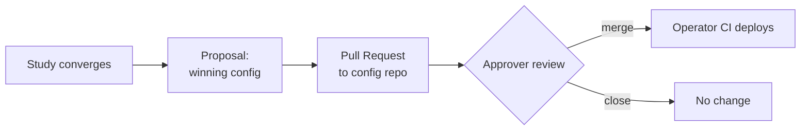

# Git-as-Source-of-Truth

!!! abstract "Summary"
    RelyLoop never edits your cluster. The output of a study is a **Pull
    Request** against your central search-config Git repo. Your named
    approvers merge it; your CI deploys it. Git is the audit trail, the review
    surface, and the deployment trigger — RelyLoop's job ends at the PR.

## Why end at a PR

Production search config is a high-blast-radius change. Teams already have a
trusted way to manage those: version control, code review, and CI. RelyLoop
plugs into that posture instead of inventing a parallel one.

Every change that reaches production has a diff, a reviewer, and a merge
commit. Nothing reaches the serving path without a human who holds merge
rights saying yes.

## The apply path

When you open a proposal, RelyLoop's GitHub provider:

1. Clones (or updates) the configured config repo.
2. Writes the winning parameters into the tracked config files.
3. Opens a Pull Request with the diff and a link back to the study + digest.

The PR body explains what changed and why — the digest narrative travels with
it, so the approver sees the metric movement and trade-offs without leaving
the review.

!!! note "Approval lives in the config repo, not in RelyLoop"
    RelyLoop has no in-tool "approve" button. Approval is delegated to your
    config repo's branch protection — the same named approvers and rules you
    already trust. RelyLoop cannot bypass them.

## Providers

GitHub is supported today behind a `GitProvider` adapter. GitLab and Bitbucket
are in the backlog; the adapter boundary is already in place so adding them is
an adapter, not a rewrite.

## The contrast

The closest competing optimizer — OpenSearch's Search Relevance Workbench —
has **no apply path at all**, by explicit RFC decision ("focuses on evaluation
and analysis, not production deployment mechanisms"). The Git-PR posture is one
of RelyLoop's most durable differentiators.

Back to [The Optimization Loop](optimization-loop.md).
