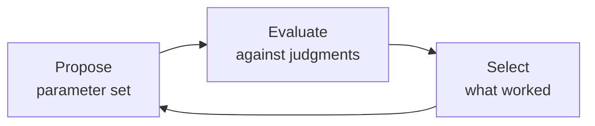

# The Optimization Loop

!!! abstract "Summary"
    RelyLoop runs a closed feedback loop — propose, evaluate, select, repeat —
    over your search engine's query-time parameters. It's a Karpathy-style
    loop in shape, and an Optuna/TPE Bayesian search in mechanism. The loop is
    the product; the chat agent and the engine adapters are how you reach it.

## The shape

The loop is the same one that shows up everywhere in machine learning:

What makes RelyLoop's version useful for search relevance is **what** sits in
each box and **where** the loop's output goes.

## The mechanism: Bayesian, not grid

The "propose" and "select" steps are an [Optuna](https://optuna.org/) study
using the **Tree-structured Parzen Estimator (TPE)** sampler. TPE builds a
probabilistic model of which regions of the search space produce good scores,
and concentrates new trials there. That's why thousands of trials converge far
faster than an exhaustive grid — and why RelyLoop can tune the *full*
query-time space at once instead of one slice.

!!! note "Why this matters versus a grid"
    OpenSearch's Hybrid Search Optimizer is a 66-cell grid restricted to
    hybrid weights. RelyLoop varies field boosts, function scores, fuzziness,
    `mm`, tie-breakers, and hybrid weights *together* — a space far too large
    to grid-search, which is exactly what Bayesian optimization is for.

## The evaluation: judgments + `ir_measures`

Each candidate is scored by running your **query set** against the engine and
comparing the ranked results to your **judgments** with
[`ir_measures`](https://ir-measur.es/) — a provider-abstracted IR-evaluation
engine. You get cut-aware metrics (nDCG\@k, ERR, precision\@k, …) computed the
same way regardless of engine.

## Where the loop's output goes

The loop does **not** push changes to your cluster. Its output is a winning
configuration, captured as a **proposal** and opened as a **Pull Request**
against your config repo. The loop ends at the PR; humans and CI take it from
there. This is the deliberate, change-managed posture — RelyLoop is for
offline experimentation, never the live serving path.

## What the loop never touches

- Schema, mappings, or analyzer settings — tuning is **query-time only**.
- Production traffic — there is no online A/B test and no bandit.
- Learned reranker models — LTR training is out of scope for v1.

See the related concepts: [Query Sets & Judgments](query-sets.md),
[Search Space](search-space.md), [Optimization Trials](trials.md), and
[Git-as-Source-of-Truth](git-source-of-truth.md).
