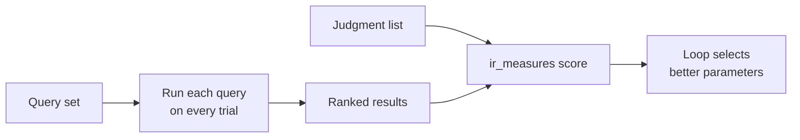

# Query Sets & Judgments

!!! abstract "Summary"
    A **query set** is the list of queries you want to optimize for. A
    **judgment list** holds per-query, per-document relevance ratings — the
    ground truth the loop scores against. Together they define what "good
    relevance" means for your corpus.

## Query sets

A query set is a named collection of queries representative of the traffic you
care about — head terms, long-tail phrases, known problem queries. The loop
runs every query in the set on each trial, so the set is the lens through
which all optimization happens. Optimize for the queries that matter, not a
synthetic average.

## Judgment lists

A judgment list pairs each `(query, document)` with a relevance rating. Those
ratings are what `ir_measures` compares the engine's ranked results against to
produce a score. Two ways to build them:

=== "Human-rated"

    Author judgments by hand or import from an existing workbench (e.g.
    Quepid). Best when you have domain experts and a stable query set.

=== "LLM-as-judge"

    Use the `generate_judgments_from_*` tool: the configured model rates each
    candidate document against the query with a customizable prompt. Every
    rating persists the **exact model identifier** (e.g.
    `openai:gpt-4o-2024-08-06`) so a judgment is always traceable to the model
    that produced it.

!!! tip "UBI-derived judgments (shipped in MVP2)"
    RelyLoop reads the standardized UBI schema (`ubi_queries` + `ubi_events`)
    identically across all three engines, turning real click/dwell signals
    into judgments — including a hybrid UBI + LLM mode. Shipped in MVP2.

## How they feed the loop

A study binds one query set and one judgment list. Swap either and you've
changed the objective — which is exactly how you'd optimize a new market,
language, or product line.

Next: what the loop actually varies — the [Search Space](search-space.md).
