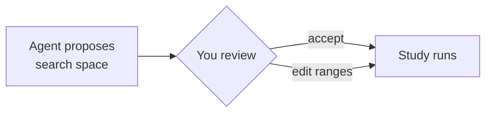

# Search Space

!!! abstract "Summary"
    The **search space** is the set of query-time parameters the loop is
    allowed to vary, plus their ranges. The LLM agent proposes one; you accept
    or edit it. It is deliberately scoped to query-time tuning — never schema,
    mappings, or analyzers.

## What's in the space

RelyLoop tunes the parameters that shape ranking *at query time*:

- **Field boosts** — how much each field contributes to the score.
- **Function scores** — recency, popularity, and other score modifiers.
- **Fuzziness** — tolerance for typos and near-matches.
- **`mm` (minimum-should-match)** — how many query terms must match.
- **Tie-breakers** — `dis_max`/`tie` behavior across fields.
- **Hybrid weights** — the lexical/semantic blend, where hybrid search is used.

These are varied **together**. The interaction between, say, field boosts and
`mm` is exactly the kind of thing a human tuning one knob at a time misses,
and exactly what a Bayesian search over the joint space finds.

## What the LLM proposes — and why a human stays in the loop

The chat agent proposes the search space because choosing *which* parameters
to vary, and over *what* ranges, benefits from understanding the corpus and
the intent behind the query set. The LLM is good at that framing. But the
proposal is a starting point, not an authority:

You can widen, narrow, or drop parameters before the study runs. The
optimization itself is fully deterministic given the space — the LLM proposes
the *space*, Optuna searches it.

## What's deliberately out of the space

!!! warning "Query-time only"
    RelyLoop does not modify schema, field mappings, or analyzer settings.
    Those are structural decisions with reindex cost and broad blast radius —
    out of scope by design. If a relevance problem can only be fixed by
    changing the mapping, RelyLoop will not paper over it with query-time
    parameters.

Next: how each point in the space gets scored — [Optimization
Trials](trials.md).
