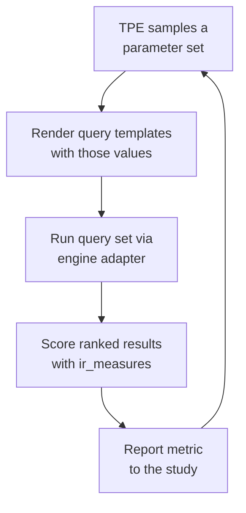

# Optimization Trials

!!! abstract "Summary"
    A **trial** is one evaluation of one candidate parameter set: render the
    query templates, run the query set against the engine, score the results
    against the judgments. Optuna's TPE sampler uses the scores so far to pick
    the next trial. Thousands of trials make a study.

## Anatomy of a trial

Each trial is independent and reproducible: same parameters, same corpus, same
judgments → same score. That determinism is what makes the resulting proposal
trustworthy.

## How scoring works

Trials are scored with [`ir_measures`](https://ir-measur.es/), which computes
standard information-retrieval metrics over the ranked results versus your
judgments. The study optimizes a chosen objective metric — commonly **nDCG@k**,
but ERR, precision@k, and others are available. Because `ir_measures`
abstracts the metric backend, the number means the same thing whether the
engine underneath was Elasticsearch, OpenSearch, or Solr.

## Why TPE beats a grid

A grid search evaluates every combination on a fixed lattice — cost explodes
with each parameter added, so practical grids stay tiny (OpenSearch's is 66
cells over hybrid weights alone). TPE instead:

1. Models which regions of the space tend to score well.
2. Spends trials where the model expects improvement.
3. Updates the model after each trial.

That lets RelyLoop search a high-dimensional, continuous space in a few
thousand trials — exploring corners a grid could never afford to visit.

## Running studies unattended

Studies persist their state in Optuna's RDB storage, so a study can run
overnight and resume cleanly. `feat_auto_followup_studies` chains studies so a
finished run can kick off the next — useful as corpora and query sets drift.

## What you see while it runs

The `/studies/[id]` view renders trial scatter plots (metric vs. trial) and
**parameter-importance** bars (which knobs actually moved the score). When the
study converges, the best trial's parameters become the **proposal**.

Next: how that proposal reaches production — [Git-as-Source-of-Truth](git-source-of-truth.md).
