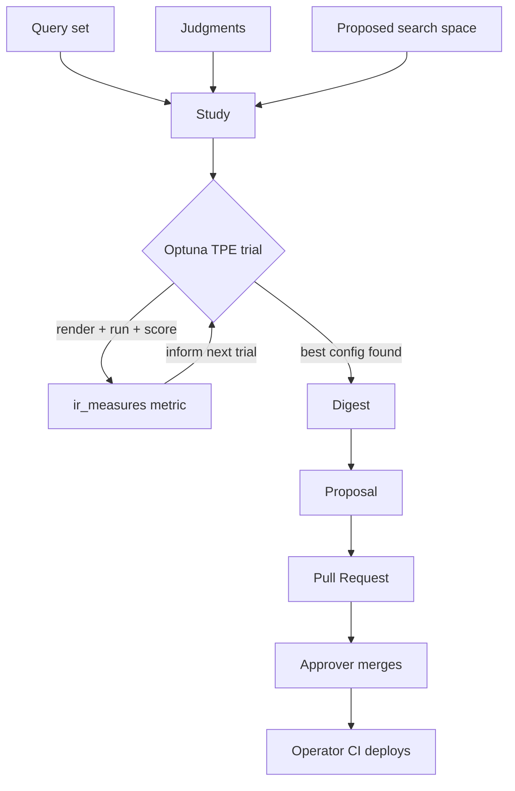

# Your First Optimization Loop

!!! abstract "What you'll learn"
    How one full RelyLoop study runs end-to-end — from a query set and
    judgments, through thousands of Optuna trials, to a Pull Request your
    approvers merge. This is the concrete version of the
    [Quickstart](quickstart.md), with a worked example.

## The example

Say you run an e-commerce search over the sample `products` index, and
relevance for head queries like `wireless headphones` and `running shoes`
feels off — the right products are on page two. You want to tune the
query-time parameters without guessing.

## Step 1 — Define what "good" means

A study optimizes against a **query set** (the queries you care about) and a
**judgment list** (per-query, per-document relevance ratings). You can:

- Author judgments by hand, or
- Generate them with the LLM-as-judge tool (`generate_judgments_from_*`),
  which rates each candidate document against the query using your configured
  model — every rating captures the exact model identifier for lineage.

See [Query Sets & Judgments](../concepts/query-sets.md) for the data model.

## Step 2 — Let the agent propose a search space

Tell the chat agent what you're optimizing. It proposes a **search space** —
the set of query-time parameters to vary and their ranges: field boosts,
function scores, fuzziness, `mm`, tie-breakers, hybrid weights. You can accept
or edit it. Nothing about schema, mappings, or analyzers is touched — tuning
is query-time only.

See [Search Space](../concepts/search-space.md).

## Step 3 — Run the trials

The study hands the search space to Optuna's TPE sampler. Each **trial**:

1. Samples a candidate parameter set.
2. Renders your query templates with those values.
3. Runs the query set against the cluster through the engine adapter.
4. Scores the ranked results against your judgments with `ir_measures`
   (nDCG, ERR, precision@k, and friends).

TPE uses the scores so far to propose more promising parameter sets — thousands
of trials, converging far faster than a grid sweep.

See [Optimization Trials](../concepts/trials.md).

## Step 4 — Read the digest

When the study ends, RelyLoop writes a **digest**: a plain-language narrative
of which parameters moved the metric, by how much, and the trade-offs. It's
the human-readable answer to "what did the loop learn?"

## Step 5 — Open the Pull Request

The winning configuration becomes a **proposal**. Opening it creates a Pull
Request against your central search-config Git repo — diffing the new
parameters against what's live. Your named approvers review it; your CI
deploys on merge. RelyLoop never touches the serving path itself.

See [Git-as-Source-of-Truth](../concepts/git-source-of-truth.md).

## The loop, end to end

That's one loop. Chain studies (`feat_auto_followup_studies`) to keep
optimizing as your corpus and queries evolve.
