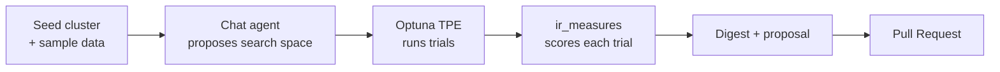

# Quickstart

!!! abstract "Summary"
    Five minutes from a running stack to a seeded cluster and the chat agent.
    Assumes you've already done the [Install](install.md) step (`make up` +
    `make migrate`).

## 1. Seed a cluster and sample data

RelyLoop ships a 1,000-document sample `products` index so you can run a real
study without wiring up your own corpus first.

```bash
make seed-clusters   # register local-es + local-opensearch
make seed-es         # index samples/products.json into local-es (1,000 docs)
```

`make seed-clusters` inserts two rows into the `clusters` registry — one for
the bundled Elasticsearch, one for OpenSearch. `make seed-es` loads the sample
catalog so there's something to search.

## 2. Open the chat agent

```bash
open http://localhost:3000/chat
```

The conversational agent is the front door. It describes the loop, proposes a
search space, and dispatches the same tools the API exposes —
`start_study`, `generate_judgments_*`, `open_proposal`. Ask it something like:

> Run a study against the products index on local-es and tune relevance for my
> query set.

## 3. Watch the loop run

A study spins up an Optuna TPE optimization over the query-time search space.
Each **trial** renders the query templates with a candidate parameter set,
runs your query set against the cluster, and scores the results against your
**judgments** with `ir_measures`. The agent reports progress; the
`/studies` and `/studies/[id]` pages show trial scatter plots and parameter
importance.

## 4. Review the proposal

When the study finishes, RelyLoop writes a **digest** (a plain-language
summary of what moved the metric and why) and stages a **proposal** — the
winning configuration, ready to open as a Pull Request against your config
repo. Review it on `/proposals`.

## What just happened



You ran the full loop end-to-end against bundled data. Next, do it with a real
example and a real PR in [Your First Optimization Loop](first-loop.md).

!!! tip "Prefer the guided tutorial?"
    The repo's [`tutorial-first-study.md`](https://github.com/SoundMindsAI/relyloop/blob/main/docs/08_guides/tutorial-first-study.md)
    walks the entire path from `git clone` to "PR opened in GitHub" with
    screenshots, including a local-LLM (Ollama) variant.
