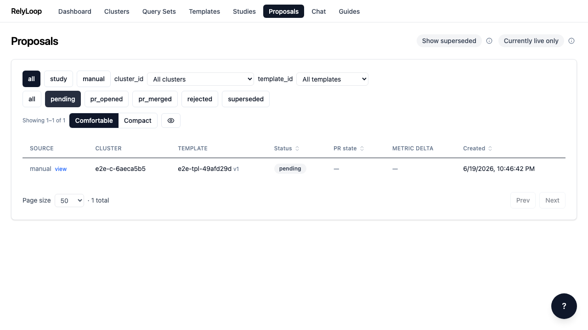
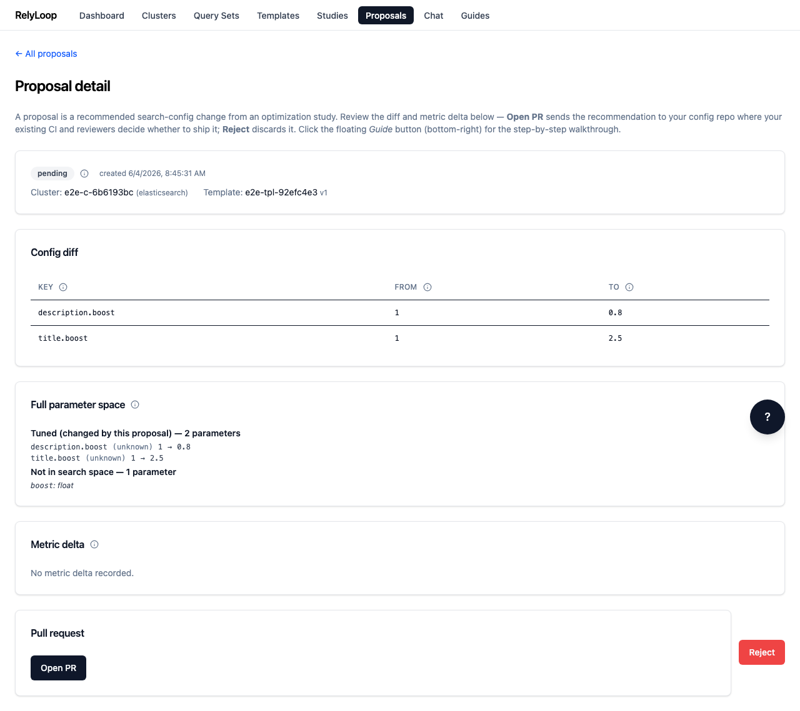

<!-- GENERATED by website/scripts/build_guides.py from ui/public/guides/02_review_a_proposal/ — DO NOT EDIT. -->

# Review a proposal

!!! info "About this walkthrough"
    **Estimated time:** 2 minutes
    **Tags:** proposals, review, git-ops

Open a pending proposal, read the config diff and metric delta, then decide whether to open a PR or reject.

<video controls playsinline preload="metadata" class="walkthrough-video">
  <source src="../../../assets/guides/02_review_a_proposal/walkthrough.mp4" type="video/mp4">
  <source src="../../../assets/guides/02_review_a_proposal/walkthrough.webm" type="video/webm">
  <track kind="captions" src="../../../assets/guides/02_review_a_proposal/captions.vtt" srclang="en" label="Steps" default>
  
Your browser cannot play the embedded video.

</video>

Trouble playing? <a href="../../../assets/guides/02_review_a_proposal/walkthrough.webm">Download the walkthrough video</a>.

## Step 1 — Open the Proposals page. Every winning study config…

## Step 2 — Click the 'pending' chip to narrow to proposals…

## Step 3 — Click a proposal row to open its detail…

## Step 4 — The Config diff panel is the load-bearing review…

## Step 5 — If the proposal isn't right — wrong cluster,…

[← Back to walkthroughs](index.md)
