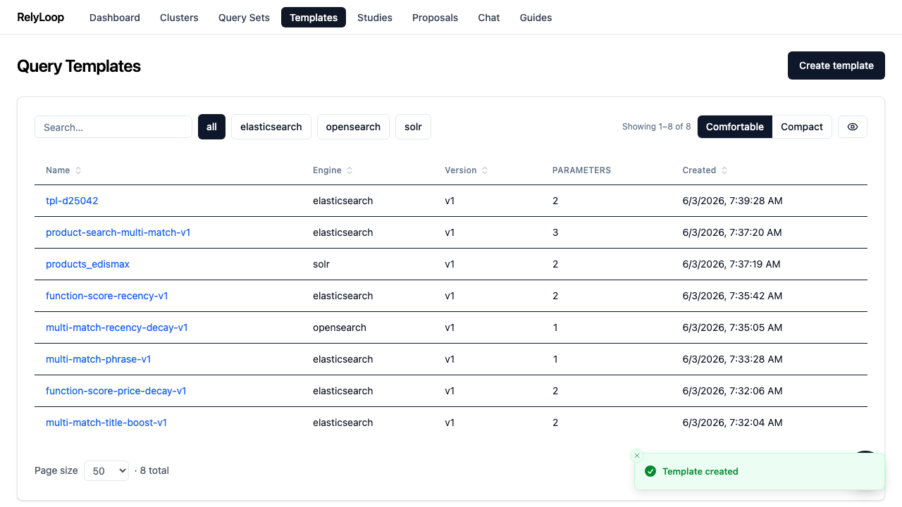

<!-- GENERATED by website/scripts/build_guides.py from ui/public/guides/03_create_query_template/ — DO NOT EDIT. -->

# Create a query template

!!! info "About this walkthrough"
    **Estimated time:** 3 minutes
    **Tags:** templates, setup, search-dsl

Define the Jinja2 query template — the 'knobs' Optuna will tune across trials — and learn the fork-to-v2 versioning pattern.

<video controls playsinline preload="metadata" class="walkthrough-video">
  <source src="../../assets/guides/03_create_query_template/walkthrough.mp4" type="video/mp4">
  <source src="../../assets/guides/03_create_query_template/walkthrough.webm" type="video/webm">
  
Your browser cannot play the embedded video.

</video>

Trouble playing? <a href="../../assets/guides/03_create_query_template/walkthrough.webm">Download the walkthrough video</a>.

## Step 1 — Open the Templates page. Every query template defines…

## Step 2 — The create modal expects three things: a name,…

## Step 3 — The body is a JSON template that embeds…

## Step 4 — Submit. RelyLoop validates the Jinja2 syntax + checks…

## Step 5 — Templates are immutable — to evolve them, you…

[← Back to walkthroughs](index.md)
