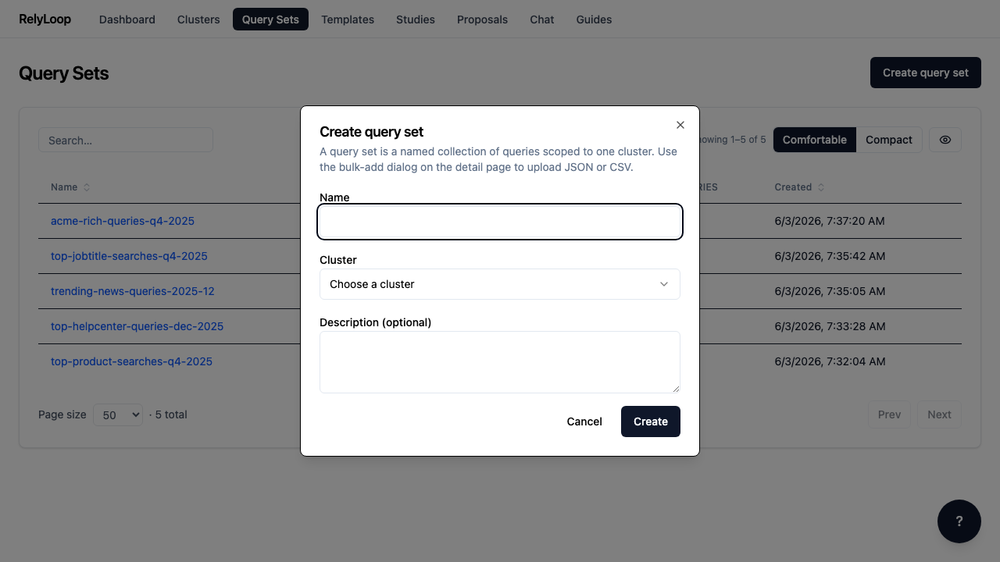
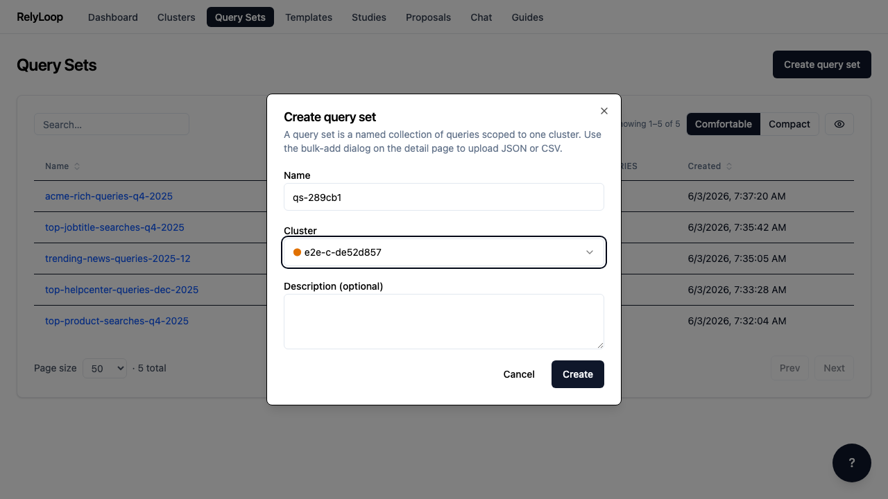
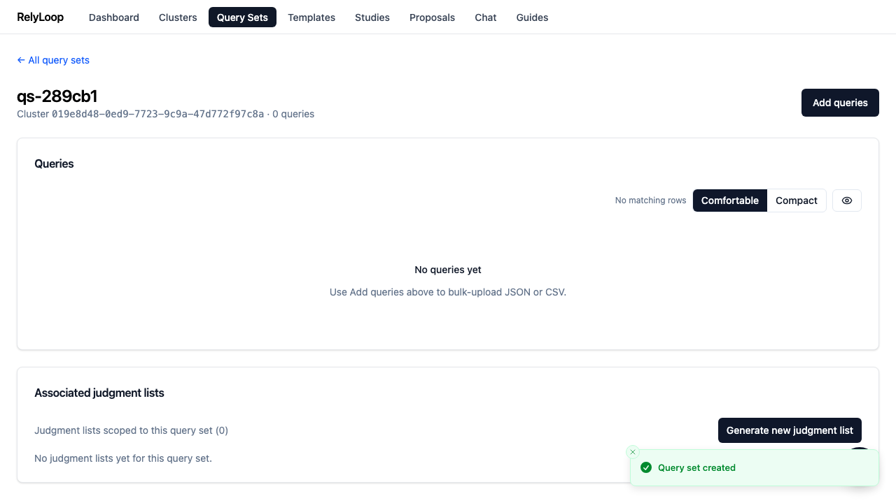

<!-- GENERATED by website/scripts/build_guides.py from ui/public/guides/04_create_query_set/ — DO NOT EDIT. -->

# Create a query set

!!! info "About this walkthrough"
    **Estimated time:** 2 minutes
    **Tags:** query-sets, setup, benchmark

Define the benchmark queries you want to tune for — the stable list every study scores against.

<video controls playsinline preload="metadata" class="walkthrough-video">
  <source src="../../assets/guides/04_create_query_set/walkthrough.mp4" type="video/mp4">
  <source src="../../assets/guides/04_create_query_set/walkthrough.webm" type="video/webm">
  
Your browser cannot play the embedded video.

</video>

Trouble playing? <a href="../../assets/guides/04_create_query_set/walkthrough.webm">Download the walkthrough video</a>.

## Step 1 — Open the Query Sets page. A 'query set'…

## Step 2 — The modal expects three things: a name, the…

## Step 3 — Fill in the name and cluster ID. The…

## Step 4 — After submit, the new query set lands in…

## Step 5 — Click 'Add queries' to open the upload dialog.…

[← Back to walkthroughs](index.md)
