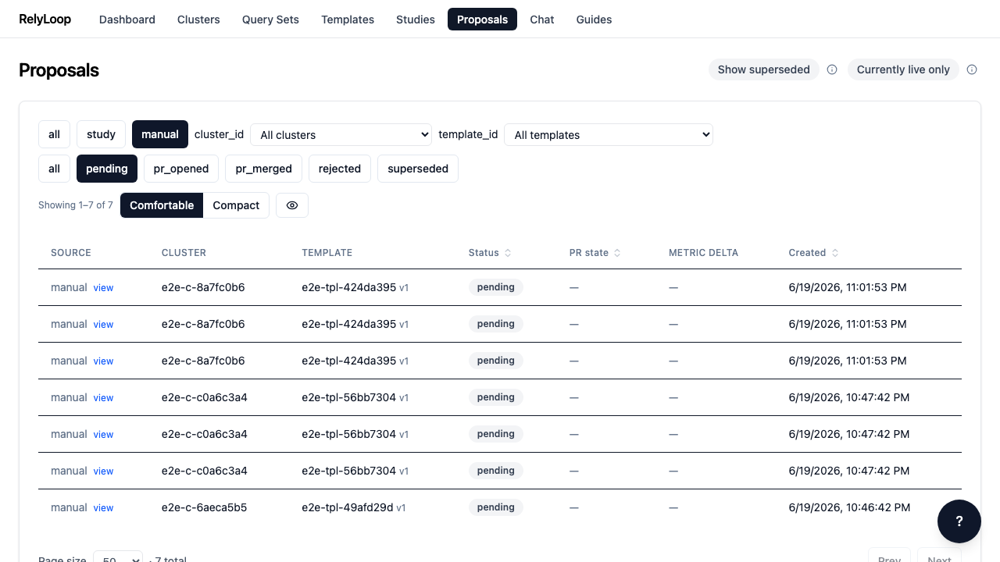

<!-- GENERATED by website/scripts/build_guides.py from ui/public/guides/07_browse_proposals/ — DO NOT EDIT. -->

# Browse proposals

!!! info "About this walkthrough"
    **Estimated time:** 2 minutes
    **Tags:** proposals, filters, queue-management

Filter the proposal queue by status, source, and cluster — three-axis URL-backed filtering with 30-second pulse-refetch when PRs are open.

<video controls playsinline preload="metadata" class="walkthrough-video">
  <source src="../../../assets/guides/07_browse_proposals/walkthrough.mp4" type="video/mp4">
  <source src="../../../assets/guides/07_browse_proposals/walkthrough.webm" type="video/webm">
  <track kind="captions" src="../../../assets/guides/07_browse_proposals/captions.vtt" srclang="en" label="Steps" default>
  
Your browser cannot play the embedded video.

</video>

Trouble playing? <a href="../../../assets/guides/07_browse_proposals/walkthrough.webm">Download the walkthrough video</a>.

## Step 1 — Open the Proposals page. Every winning study config…

## Step 2 — Click the 'pending' status chip. URL updates to…

## Step 3 — Source filter chips narrow by proposal origin: `study`…

## Step 4 — The cluster filter dropdown narrows the queue to…

## Step 5 — Reset filters by clicking 'all' chips. The empty-state…

[← Back to walkthroughs](index.md)
