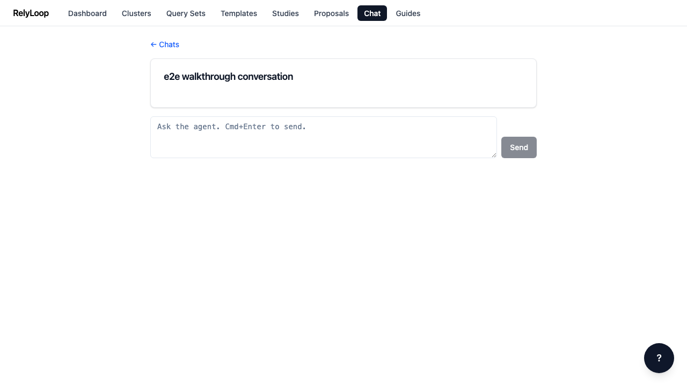

<!-- GENERATED by website/scripts/build_guides.py from ui/public/guides/08_chat_shell/ — DO NOT EDIT. -->

# Chat shell — conversations + composer

!!! info "About this walkthrough"
    **Estimated time:** 2 minutes
    **Tags:** chat, shell, conversations

Navigate the chat conversation list, start a new chat, and understand the secrets-warning banner. Message streaming with the agent is covered in guide 10.

<video controls playsinline preload="metadata" class="walkthrough-video">
  <source src="../../../assets/guides/08_chat_shell/walkthrough.mp4" type="video/mp4">
  <source src="../../../assets/guides/08_chat_shell/walkthrough.webm" type="video/webm">
  
Your browser cannot play the embedded video.

</video>

Trouble playing? <a href="../../../assets/guides/08_chat_shell/walkthrough.webm">Download the walkthrough video</a>.

## Step 1 — Open the Chat page. Past conversations are listed…

## Step 2 — Click a past conversation to resume it. The…

## Step 3 — Dismiss the banner with the X button. The…

## Step 4 — From the conversation list, click 'New conversation' to…

[← Back to walkthroughs](index.md)
