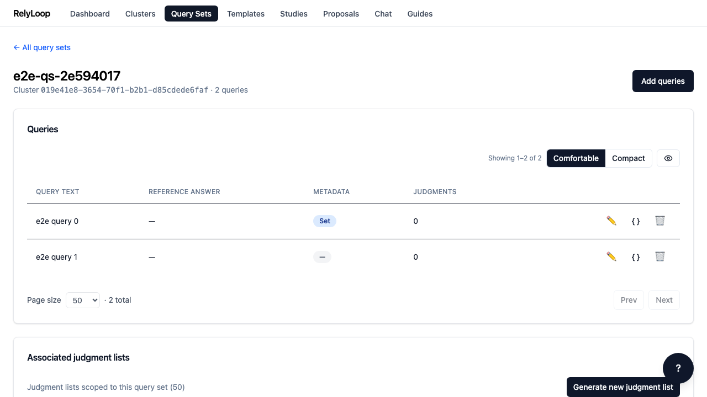
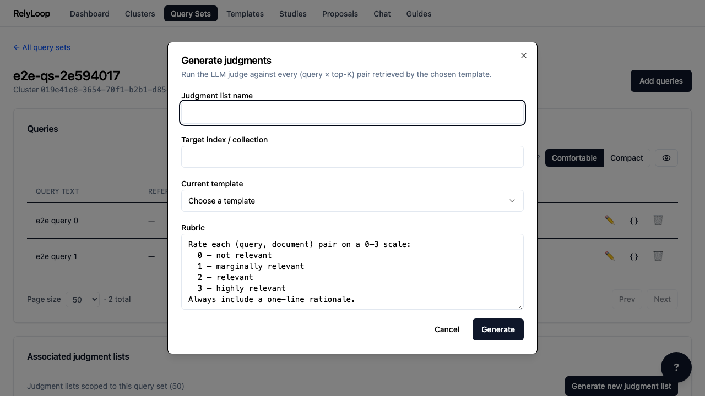

<!-- GENERATED by website/scripts/build_guides.py from ui/public/guides/09_generate_judgments_llm/ — DO NOT EDIT. -->

# Generate judgments via LLM

!!! info "About this walkthrough"
    **Estimated time:** 5 minutes (mostly waiting on the worker)
    **Tags:** judgments, llm, ground-truth

Trigger the LLM-as-judge worker against a query set — every (query, top-K doc) pair is rated 0-3 with a real OpenAI call. The deterministic alternative is the import path (guide 05).

<video controls playsinline preload="metadata" class="walkthrough-video">
  <source src="../../../assets/guides/09_generate_judgments_llm/walkthrough.mp4" type="video/mp4">
  <source src="../../../assets/guides/09_generate_judgments_llm/walkthrough.webm" type="video/webm">
  <track kind="captions" src="../../../assets/guides/09_generate_judgments_llm/captions.vtt" srclang="en" label="Steps" default>
  
Your browser cannot play the embedded video.

</video>

Trouble playing? <a href="../../../assets/guides/09_generate_judgments_llm/walkthrough.webm">Download the walkthrough video</a>.

## Step 1 — Open a query set's detail page. The 'Associated…

## Step 2 — Click 'Generate judgments' to open the dialog. The…

## Step 3 — Fill the text fields: a unique name for…

## Step 4 — Open the template dropdown and pick the query…

## Step 5 — Submit. The worker enqueues immediately (202 ACCEPTED) and…

[← Back to walkthroughs](index.md)
