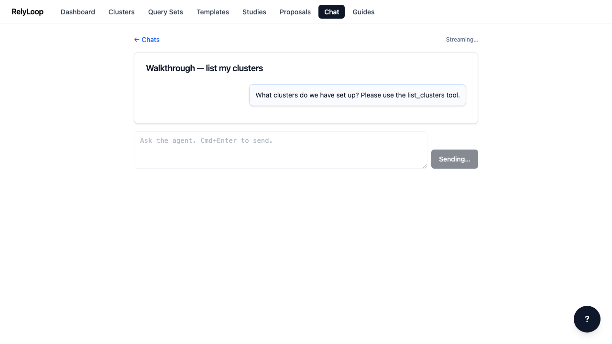

<!-- GENERATED by website/scripts/build_guides.py from ui/public/guides/10_chat_with_agent/ — DO NOT EDIT. -->

# Chat with the agent (real LLM)

!!! info "About this walkthrough"
    **Estimated time:** 3 minutes
    **Tags:** chat, agent, tools, llm

Send a prompt, watch the agent dispatch a tool call, and read the final assistant response. Exercises the full SSE streaming pipeline against the live OpenAI endpoint.

<video controls playsinline preload="metadata" class="walkthrough-video">
  <source src="../../../assets/guides/10_chat_with_agent/walkthrough.mp4" type="video/mp4">
  <source src="../../../assets/guides/10_chat_with_agent/walkthrough.webm" type="video/webm">
  
Your browser cannot play the embedded video.

</video>

Trouble playing? <a href="../../../assets/guides/10_chat_with_agent/walkthrough.webm">Download the walkthrough video</a>.

## Step 1 — Open a chat conversation. The composer at the…

## Step 2 — Type a clear, action-oriented prompt that reliably triggers…

## Step 3 — Send. Your message appears immediately as a user…

## Step 4 — Within ~500ms the agent emits a `tool_call` SSE…

## Step 5 — The agent reasons over the tool result and…

[← Back to walkthroughs](index.md)
