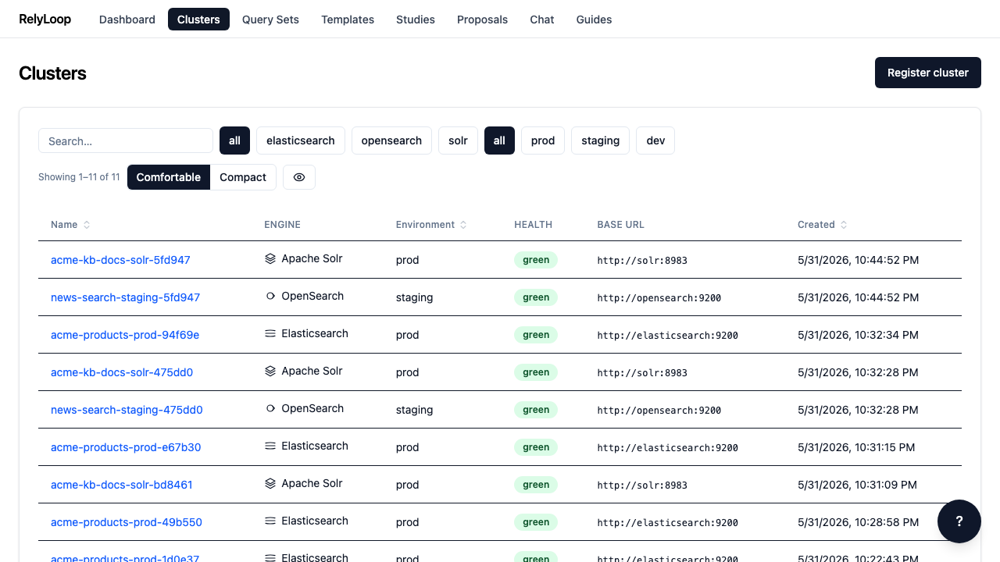
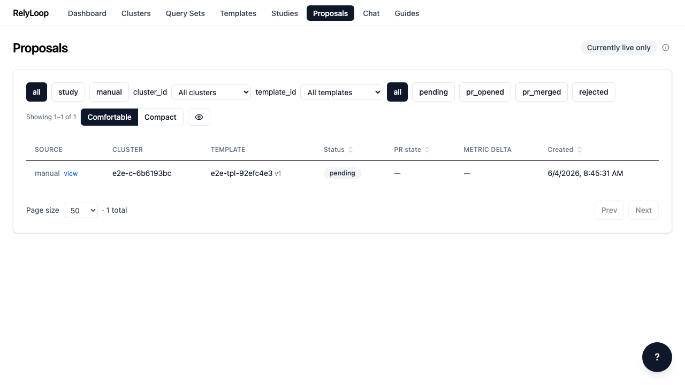
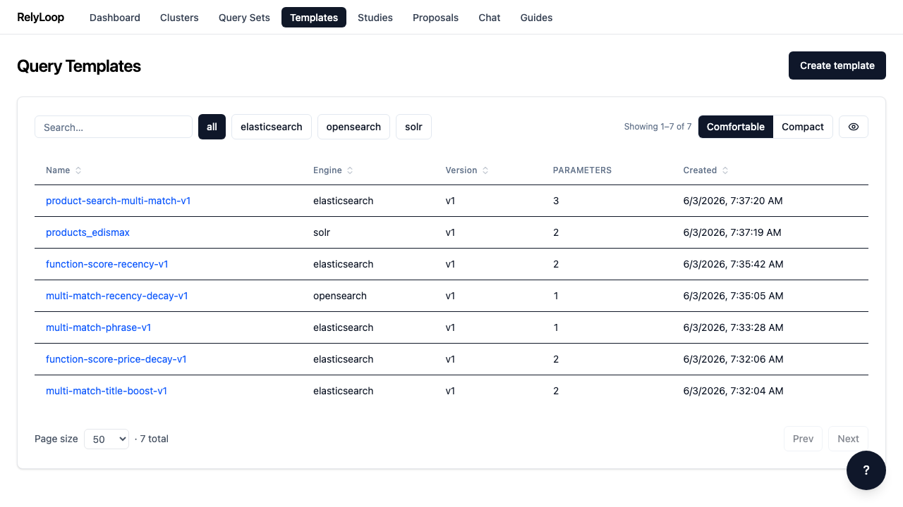
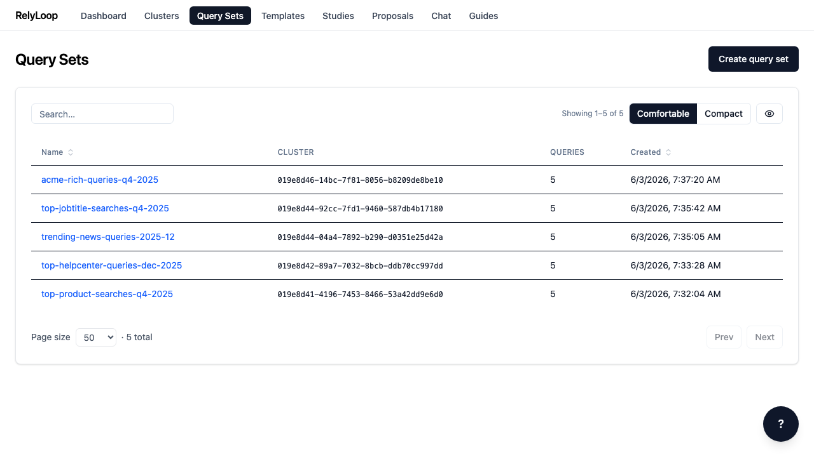
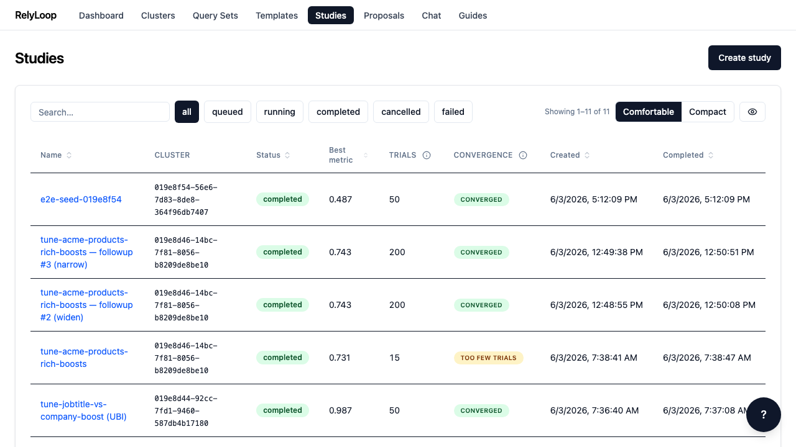
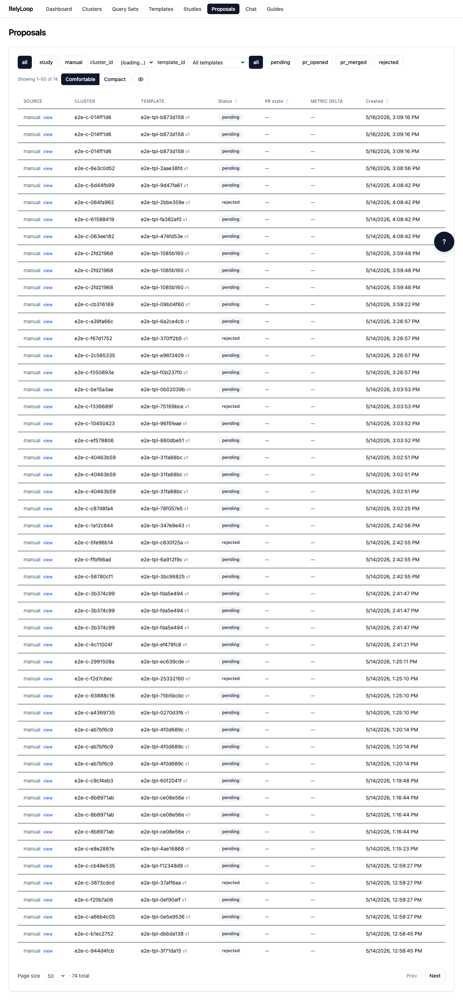
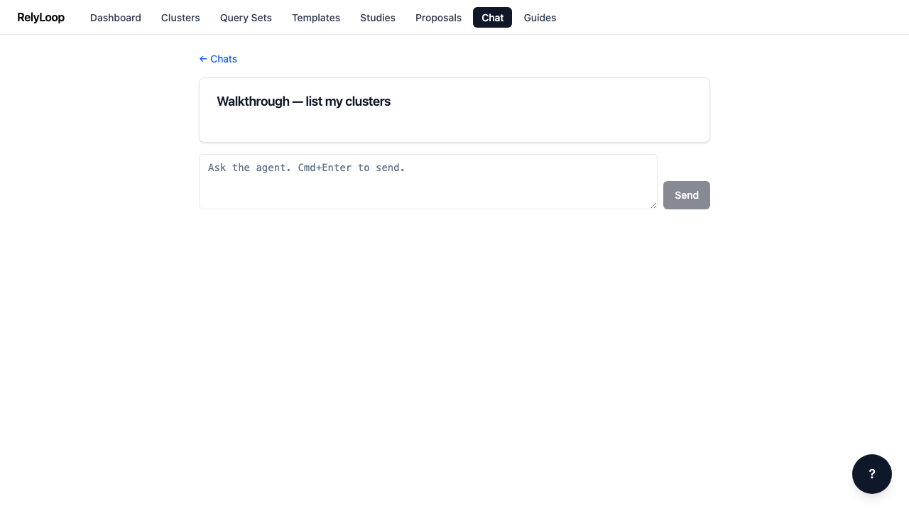

<!-- GENERATED by website/scripts/build_guides.py from ui/public/guides/*/metadata.json — DO NOT EDIT. -->

# Walkthroughs

Short, click-through walkthroughs of every RelyLoop workflow — each a sequence of annotated screenshots with a slow-motion video. Start with registering a cluster and follow the loop all the way to a merged configuration PR.

-   ### [Register your first cluster](01_register_first_cluster.md)

    [{.glightbox-skip}](01_register_first_cluster.md)

    ⏱ 3 minutes · 🏷 getting-started

    [Open walkthrough →](01_register_first_cluster.md)

-   ### [Review a proposal](02_review_a_proposal.md)

    [{.glightbox-skip}](02_review_a_proposal.md)

    ⏱ 2 minutes · 🏷 proposals

    [Open walkthrough →](02_review_a_proposal.md)

-   ### [Create a query template](03_create_query_template.md)

    [{.glightbox-skip}](03_create_query_template.md)

    ⏱ 3 minutes · 🏷 templates

    [Open walkthrough →](03_create_query_template.md)

-   ### [Create a query set](04_create_query_set.md)

    [{.glightbox-skip}](04_create_query_set.md)

    ⏱ 2 minutes · 🏷 query-sets

    [Open walkthrough →](04_create_query_set.md)

-   ### [Import judgments + calibrate](05_import_judgments_and_calibrate.md)

    [{.glightbox-skip}](05_import_judgments_and_calibrate.md)

    ⏱ 3 minutes · 🏷 judgments

    [Open walkthrough →](05_import_judgments_and_calibrate.md)

-   ### [Create and monitor a study](06_create_and_monitor_study.md)

    [{.glightbox-skip}](06_create_and_monitor_study.md)

    ⏱ 5 minutes · 🏷 studies

    [Open walkthrough →](06_create_and_monitor_study.md)

-   ### [Browse proposals](07_browse_proposals.md)

    [{.glightbox-skip}](07_browse_proposals.md)

    ⏱ 2 minutes · 🏷 proposals

    [Open walkthrough →](07_browse_proposals.md)

-   ### [Chat shell — conversations + composer](08_chat_shell.md)

    [{.glightbox-skip}](08_chat_shell.md)

    ⏱ 2 minutes · 🏷 chat

    [Open walkthrough →](08_chat_shell.md)

-   ### [Generate judgments via LLM](09_generate_judgments_llm.md)

    [{.glightbox-skip}](09_generate_judgments_llm.md)

    ⏱ 5 minutes (mostly waiting on the worker) · 🏷 judgments

    [Open walkthrough →](09_generate_judgments_llm.md)

-   ### [Chat with the agent (real LLM)](10_chat_with_agent.md)

    [{.glightbox-skip}](10_chat_with_agent.md)

    ⏱ 3 minutes · 🏷 chat

    [Open walkthrough →](10_chat_with_agent.md)

